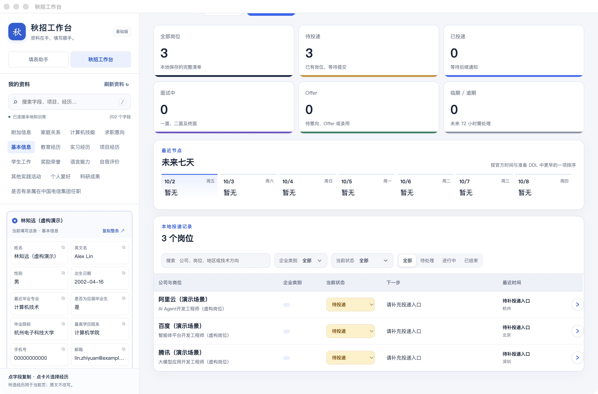
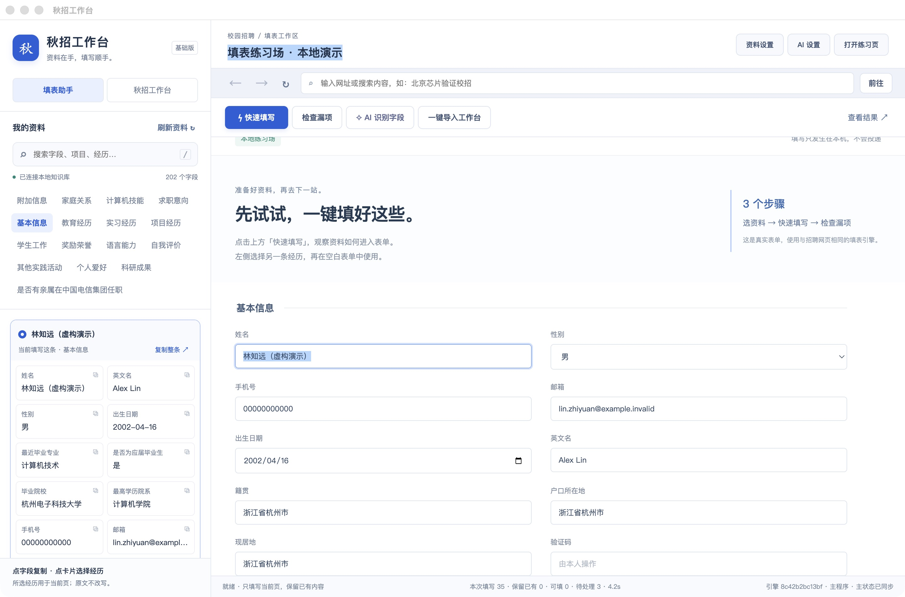

> 历史归档（2026-10-05）：本文记录当时的设计和实现状态，部分结论已过时。当前使用见[使用指南](../../工作台使用与运维.md)，范围见[主计划](../../产品实施Plan-v1.md)，完成状态见[实施台账](../../implementation/实施与审查台账.md)。

# 界面重设计与智能工作流

2026-10-02，根据用户实际使用反馈修订。本文确定信息架构和交互原则，附本次实际界面检查；不是新 UI 已上线的声明，也不是最终视觉稿。

## 1. 需要修正的设计判断

上一版把业务模块直接变成八个一级页面，并把个人资料列为一级入口，割裂了使用流程。修正为围绕用户每日行动、寻找机会、推进申请、准备面试组织界面。个人资料初次建立后作为设置维护，只在任务缺资料或需换简历时出现。

产品应自动将收到的信息转成岗位档案、进度、待办与准备材料。不能让用户在一个漂亮的表格里继续手工录入所有信息。

## 2. 本次现状检查：两步截图与结论

检查对象：当前打包应用的演示工作区，检查工具为原生窗口截图与可访问性树。只涉及现有看板和填表页，不登录招聘网站。

### 步骤 1：查看投递看板——基础可用，任务优先级不足

当前滚动位置的截图显示：左侧个人资料跨页面常驻，约占窗口四分之一；右侧大块统计和空白日历占据主要空间，具体岗位行动在下方。表格和状态筛选有复用价值，但“下一步”还是通用提示，不能回答“我现在先做哪件事”。截图顶部不包含完整看板页头，不能据此判断页头的全部布局。

建议：移走常驻资料栏；缩小汇总统计；首页优先展示有截止、有动作的任务及新变化。无日程时提供添加机会/连接邮箱的下一步，不占据大面积空卡片。

### 步骤 2：查看填表页——浏览器基础已有，正式任务入口不清楚

浏览器导航和可交互表单已存在，但资料栏、标题、设置、练习入口和多个同级动作挤压网页。用户看到默认练习场，很容易把产品理解为表单演示器。底部引擎版本等调试信息不应占普通用户主界面。

代码 `main.cjs` 已用 `WebContentsView` 加载真实 URL；目前看到的是其中加载的本地练习页。真实浏览器能力不等于任意招聘网站已适配。正式启动应进入今日页；练习场移到帮助/首次教学。

建议：从具体岗位直接进入对应官网；以真实网页为主，显示本次任务及待处理问题；开发细节折叠到诊断。用真实网站的填写/保存结果验收，不能用练习页成功替代。

可访问性检查范围：截图能观察到较淡的次要文字、拥挤的信息层级和小型详情入口；需要后续测量对比度，并测试键盘焦点、窗口缩放、隐藏浏览器区域的读屏行为。截图与树中出现标签不代表完整可访问性合规。

## 3. 导航决定：一条侧栏，四个主入口，底部设置

| 入口 | 核心问题 | 页面内容 |
|---|---|---|
| 今日 | 我现在要做什么？ | 今日行动、截止时间、面试、提醒、最近变化；列表/日历页签 |
| 机会 | 有什么值得投？ | 搜索发现、关注公司、开放/截止、岗位要求、来源与匹配依据 |
| 投递 | 每个申请进行到哪？ | 申请列表、进度时间线、待办、已提交材料、继续填写 |
| 面试准备 | 我该如何准备这场面试？ | 公司/业务/产品/岗位简报、我的相关经历、问题与复盘 |
| 设置（底部） | 我的资料和连接怎么维护？ | 个人资料与 PDF、邮箱、AI、提醒、备份与账号 |

不增加第二条常驻侧栏。公司详情、岗位详情、面试简报是上下文页面，用页签和返回路径；临时证据/纠错用可关闭抽屉。设置中的个人资料仍是完整管理页面，不降低其编辑和 PDF 管理能力。

“网申”作为具体岗位的浏览器任务，不单列内容频道；可保留最近未完成任务快捷入口。“邮箱”作为信息来源，连接归设置，通知原文挂在各自的事件证据上；待确认箱从今日页与顶部通知进入。

## 4. 真正填表时，用户看到什么

1. 从岗位卡片点“开始申请”，或从投递点“继续填写”；亦可粘贴网址创建任务。
2. 打开真实招聘网站，显示真实地址、加载状态、后退/刷新。第一次选择当前投递简历，之后记住岗位绑定版本。
3. 用户在网站登录；软件根据实际可见表单扫描并填写，网页值随执行变化。
4. 工具栏用简短语言报告“正在填写教育经历”“上传简历中”“有两项需要你处理”。执行日志默认收起；可定位问题字段。
5. 用户可随时暂停或接管。接管期间自动化停止写入，继续前重新扫描，避免与用户操作竞争。
6. 从资料库自动选择已绑定 PDF 并上传，检测网站接收/拒绝；若网站先解析附件再生成字段，应先上传、等待解析再补填。
7. 填完展示异常和核验结果，区分“字段已填”“网站已保存”“附件已接收”“申请已提交”。最终提交沿用用户确认边界。
8. 已有可验证的提交回执时建立投递事件；仅填完草稿不计为投递成功。返回时保留任务上下文、资料快照和实际附件版本。

浏览器主体尽量占用可用宽度；全局导航在执行时收窄。资料仅显示为“本次使用某简历版本”，缺失时打开具体字段编辑并返回当前页面，不展示全部家庭、教育和联系方式。

真实网站验收包括：登录后页面、多步骤保存、联动字段、重复经历、上传后网站解析、跳转/新窗口、停止接管、会话过期、网络失败。当前新窗口策略会在同一浏览器中导航，是否支持多标签要按登录和申请流程验证后设计，不能套用静态网页模型。

## 5. 自动补齐：哪些信息由系统主动处理

| 触发 | 自动执行 | 用户看到的结果 |
|---|---|---|
| 添加岗位链接 | 获取可访问 JD，提取公司、岗位编号、地点、要求、届别、开放/截止与原文 | 已填好的岗位档案，未知信息明确留空 |
| 关注公司 | 检查官方来源和招聘变化 | 新开放、延期、关闭等变化；来源和最后成功核验时间 |
| 完成提交 | 读取可验证回执，关联申请编号与当次材料 | 已投递时间和材料版本，无需重录公司岗位 |
| 收到可确定的招聘通知 | 关联岗位，创建/修订测评、预约、面试、补材料或 Offer 事件 | 进度和待办更新，并显示“为何更新”与撤销/纠错入口 |
| 进入面试阶段 | 联合岗位 JD、公司官方业务/产品信息和已确认个人经历生成简报 | 今日页出现“面试准备已更新”，打开即可阅读 |
| JD、面试轮次或材料来源变化 | 增量更新对应准备内容 | 标出变化和更新时间，保留用户笔记 |

明确、唯一且通过验证的信息直接更新，不要求用户再抄一次。身份关联不清、日期冲突、来源互相矛盾才进入待确认；新邮箱模板的关键日期可先采用待确认策略。模型置信分不是唯一自动生效依据，要结合来源身份、稳定编号、正文证据和已验证模板。自动变更可查看旧值和撤销，人工修正不被后台静默覆盖。

“什么时候录取”应拆开：Offer 发出/收到时间、回复截止、预计入职时间。来源没有说何时录取就显示未知；流程预测即使以后增加，也不能混入实际状态和官方日期。

后台抓取和生成任务异步运行，显示读取中、部分完成、失败重试与最后成功更新时间。公司公共资料可复用缓存，个人简报按岗位和经历生成；不因用户每次打开页面就重复全网搜索和重复付费。具体费用、覆盖和延迟待服务实测后确定。

## 6. 面试准备应生成“能用的材料”

进入一场具体面试后，默认呈现可在几分钟内读完的摘要，按需展开证据和细节。

| 内容 | 应回答的问题 | 依据 |
|---|---|---|
| 本场安排 | 哪一轮、什么时候、什么方式、需准备什么？ | 面试通知与后续改期邮件 |
| 公司与业务 | 服务谁、解决什么问题、主要业务是什么？ | 公司官网、官方产品/业务材料 |
| 与岗位相关的产品 | 哪些产品与 JD 或明确业务线相关，具体做什么？ | JD、产品页、文档；推断关系明确标注 |
| 产品体验清单 | 面试前可打开什么、体验什么、观察什么？ | 公开产品入口、帮助/演示；无访问权限则说明 |
| 岗位理解 | 工作目标、技能要求、可能面临的问题是什么？ | JD 原文；问题推测标注为准备建议 |
| 我的证据 | 哪段项目/实习能说明哪项能力，具体讲什么？ | 已确认个人资料，不虚构数字和产品使用经历 |
| 可交流观点 | 我从公开资料中理解了什么，还有什么需要请教？ | 来源事实、个人观察与待验证假设分开 |
| 面后复盘 | 实际问了什么、我如何回答、下一次要补什么？ | 用户笔记，不自动编造面试过程 |

每条关键外部事实附来源链接、来源日期（可得时）、最近核验时间与摘录；点开能核对。公司、子公司、业务线与具体团队需区分，不能把集团所有产品都归给本岗位。来源没有说明团队归属时，写“可能相关，待核实”，不自信补全。

表达建议示例（结构示例，不是对任何公司的事实判断）：

> “我看了贵公司的官方产品介绍，注意到它主要解决……。这让我想到我在……项目中处理过的……问题。我想了解这个岗位是否也会参与……？”

如果用户实际体验过并记录了观察，再帮助整理为“我体验后发现……”。系统不能仅凭抓取产品介绍就写“我长期使用过”。面试准备的价值是让用户真正理解并能追溯，而不是给一段未经核实的背诵稿。

## 7. 对现有五个工作包的调整

五个方向保留，页面不与工作包一一对应：①事件任务与③今日提醒共同支撑“今日/投递”；②邮箱给进度提供事实；④公司监控增加岗位相关的业务/产品资料采集；⑤资料与 AI 提供首次导入、低频维护和简报生成。

新增跨模块能力：面试准备生成器。新增最小对象为 Briefing（关联投递/场次）、SourceEvidence（事实与出处）、ProductRelation（产品与业务/岗位关联及依据）、ExperienceMatch（个人经历映射）、UserNote（体验和复盘）。保留事实、推断、用户笔记三个层次；旧简报刷新不覆盖用户笔记。

先确定三个核心界面的布局：今日、真实网申浏览器、面试准备。随后按资料基础 → 真实网申闭环 → 事件/邮箱 → 主动面试准备与提醒推进。首版面试简报可以由用户点击生成，稳定后改为面试事件触发自动生成，保留同一份证据结构。

## 8. 新设计的通过标准

- 默认首页不再露出个人资料全文；设置能完整维护资料、PDF 和邮箱。
- 从一个岗位到真实官网填写不需要在多个数据页来回找资料；任务能暂停、接管和继续。
- 正式网申验收使用真实页面和用户授权范围内的资料；本地练习成功只算回归测试通过。
- 添加一个岗位链接后可看到自动填好的档案；来源无法读取时明确说明，不生成看似完整的假资料。
- 一条明确通知能够更新事件和任务；同一消息不会反复新增，改期撤销旧提醒。
- 确认面试后自动形成与该岗位相关的准备材料，来源、更新时间、个人经历依据都可展开。
- 未知录取时间不猜；产品与团队关联未证实就标注；没有使用过产品不替用户宣称用过。
- 今日页优先给出具体下一步，例如“完成测评”“预约面试”“阅读这场面试简报”，不是只有岗位数量。

本轮已更新产品规划的信息架构并保存现场截图；没有修改运行中的 UI、执行真实投递或生成任何真实公司的面试事实。
