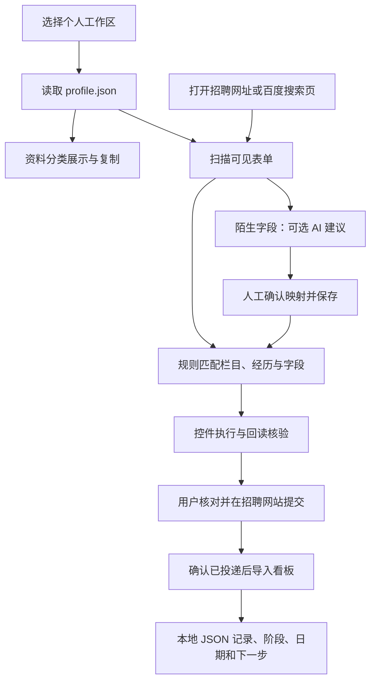

> 历史归档（2026-10-05）：本文记录当时的设计和实现状态，部分结论已过时。当前使用见[使用指南](../../工作台使用与运维.md)，范围见[主计划](../../产品实施Plan-v1.md)，完成状态见[实施台账](../../implementation/实施与审查台账.md)。

# 秋招全流程：现有实现、功能边界与 API 规划

整理日期：2026-10-02。依据当前工作区代码，而非仅依据 README 或旧 TODO。本文是现状核对与产品方案；“建议”“拟新增”均不代表功能已经上线。本次没有接入真实邮箱、采购 API 或修改运行代码。

后续补充：用户明确要求简历自动导入与 AI 整理、独立个人资料/PDF 管理页面、网申自动上传附件。最终 UI、实现盘点、五个工作包与最新开发顺序见[产品功能清单与 UI 实施路线](产品功能清单与UI实施路线.md)。其中资料与附件闭环提升为首批基础，以下保留原有全流程/API 分析。

## 1. 核心结论

当前产品是“规则填写网申 + 可选 AI 识别陌生字段 + 本地投递记录看板”。它并非只能填写网申，但还没有自动发现招聘机会、持续监控招聘节点、关联邮箱同步进度、后台主动提醒这条完整链路。

建议升级为“秋招全流程工作台”：发现岗位 → 关注开放与截止 → 准备资料并投递 → 跟踪测评和面试 → 管理待办与提醒 → 跟进 Offer。填表是其中一个执行入口。

用户提出的公司监控、邮箱同步、动态看板、今日待办均可建设。需要重点解决的是来源覆盖、事件数据模型、可靠同步和后台调度；并非加一个大模型 API 就能全部完成。不能承诺穷尽所有公司，也不能从邮箱推断招聘方没有发出的内部状态。

## 2. 现在的整体实现流程



1. Electron 提供桌面窗口和招聘浏览器；Playwright 与 DOM 规则执行页面操作。
2. `知识库/profile.json` 是个人事实的运行时来源。知识库中的其他 Markdown 是说明、依据或历史资料，不会自动全部合并进填写数据。
3. 规则引擎识别栏目、字段含义与具体经历，选择原生、Layui、Ant、Element 等控件操作分支，执行后回读。回读不等于招聘网站已保存或已提交。
4. AI 只对符合约束的陌生字段给出 `group/key` 映射建议；用户确认后存为本地规则，再由普通填写引擎取个人事实并操作页面。
5. 根据当前页面提取公司和岗位草稿，用户核对提交状态后导入看板。
6. 看板由 Electron 内嵌的本机 HTTP 服务提供，记录保存在 `投递记录.json`，当前进度主要依靠人工更新。

## 3. 具体功能盘点

| 功能 | 当前状态 | 实际边界 |
|---|---|---|
| 工作区新建、导入、示例资料 | 已有 | 个人资料仍主要通过 JSON 编辑 |
| 资料分类、全文查看与复制 | 已有 | 来源为结构化个人事实 |
| 招聘页面浏览、关键词搜索 | 已有 | 关键词打开百度搜索页，不是后台批量招聘检索 |
| 规则填表、漏项检查、回读 | 已有 | 支持范围取决于控件与站点结构；不是任意网站保证成功 |
| AI 字段识别与确认后复用 | 已有代码链路 | 需用户配置模型服务；本次未实测真实模型 |
| 用户自带 API Key、AI 开关 | 已有 | 不是运营方托管的零配置 AI 服务 |
| 岗位草稿读取、已投递确认入看板 | 已有 | 不会凭“填完表”自动断言投递成功 |
| 岗位新增、更新、筛选、阶段统计 | 已有 | 本机记录，无招聘方实时状态接口 |
| 七日日程、72 小时临期与逾期展示 | 已有基础版 | 每条岗位取一组时间中的最早值，无法完整展示多个并行任务 |
| 面试方式、会议链接、邮件依据等信息 | 已有存储/展示字段 | 有字段不代表已连接邮箱或自动生成这些信息 |
| 批量发现公司和岗位 | 未实现 | 需要搜索/来源连接器、去重与结构化提取 |
| 招聘开放、关闭、延期监控 | 未实现 | 需要周期抓取、来源快照和变化判定 |
| 邮箱绑定与增量同步 | 未实现 | 需要邮箱授权、连接器、消息去重和同步游标 |
| 邮件转测评/面试任务 | 未实现 | 需要解析、投递关联、确认和事件更新 |
| 今日待办计数与主动推送 | 未实现完整链路 | 当前临期岗位数量不等于今日任务数量，没有独立任务/提醒系统 |
| 关闭软件后继续监控 | 未实现 | 当前关闭窗口会退出应用；持续服务需要另建后台能力 |
| 托管 AI、账号与用量管理 | 未实现 | 当前只有用户自配服务模式 |

### 现有文档和界面的偏差

- `TODO.md` 仍包含已发生变化的旧设计，例如把看板内嵌、AI 服务化等全部列为待办；不能直接拿它当当前完成状态。
- 看板 `missingDueLabel()` 仍有“等待邮箱提取面试时间”“等待邮箱更新”，容易暗示已实现同步。建议改为“待补充面试时间”“待人工更新进度”，等接入后再按真实同步状态展示。
- 看板每 15 秒调用 `loadJobs()`，读取的是本地 `/api/jobs`。这与每 15 秒查询招聘网站或收取邮件完全不同。

## 4. AI 与普通功能是否分开

**当前核心路径已经分开，但未来完整业务流程还未建设。**

| 模块 | 普通程序负责 | AI 可辅助 |
|---|---|---|
| 个人资料 | 保存、校验、选择版本、备份 | 从简历提取候选事实，用户确认后入库 |
| 网申填写 | 页面扫描、取真实资料、控件操作、回读 | 识别陌生字段含义；当前仅此项已有普通用户 AI 路径 |
| 招聘发现 | 搜索请求、抓取、关注列表、周期刷新、去重 | 从非结构化公告提取岗位、要求和节点 |
| 招聘日期 | 时间格式、时区、有效期、变化比较 | 理解“招满即止”“本周五前”等文本并给出证据 |
| 邮箱同步 | 授权、收信、游标、重试、去重 | 判断招聘邮件类型，提取任务、时间和公司 |
| 投递关联 | 按岗位编号、申请编号、账号等确定性匹配 | 对名称别名和模糊线索给出关联建议 |
| 进度管理 | 状态机、事件记录、冲突处理、撤销 | 从正文提出状态变更建议，不自行决定最终状态 |
| 看板与提醒 | 查询、统计、排序、日历、调度、送达记录 | 可选解释“为何优先处理”，不是计数和提醒的必要条件 |

AI 模块应统一输出结构化候选与原文依据，由业务层验证后再落库。AI 服务不可用时，手动录入、规则填表、已有待办、看板和提醒仍应正常工作。

代码中的 `ai-mapping.cjs` 是用户功能；`ai-reader.cjs` 与历史 Codex 修复脚本是开发工具。后者目前限定显式开启的 Windows 源码开发模式，不能当成面向普通用户的 AI API。

## 5. 实际要接的 API 是什么

### 5.1 当前已经写好的模型调用

`src/ai-mapping.cjs` 直接调用：

```text
POST {用户配置的 baseUrl}/chat/completions
Authorization: Bearer {用户自己的 API Key}
Body: model、messages、temperature、max_tokens
Result: choices[0].message.content 内的 JSON 映射建议
```

没有固定厂商或固定模型；`baseUrl` 与 `model` 都由用户填写。当前请求发送字段标签、栏目、控件类型和通用字段目录，不发送个人资料事实值；标签文本本身仍可能包含敏感信息。返回不是填写答案，而是字段对应关系，置信度低于 0.8 的建议被跳过，确认后再写入站点规则。

**兼容 Chat Completions 是协议要求，不代表已经对全部兼容服务做过实测。** 需要针对选定厂商验证参数、JSON 输出、错误处理、耗时和实际准确率。

### 5.2 面向普通用户的软件，建议如何封装

建议保留自带 Key 模式，同时为普通用户提供托管模式：

```text
用户点击“识别字段 / 同步邮箱 / 关注公司”
  → 软件业务服务（本地或自有后端）
  → AI 任务适配层 / 邮箱连接器 / 招聘来源连接器
  → 对应模型、邮箱或搜索服务
  → 业务校验 → 数据库 → 看板与提醒
```

运营方模型 Key 仅保存在服务端。用户只登录软件；客户端持有产品会话令牌。账号、限流、超时、额度、幂等与失败恢复由后端实现，不能靠在安装包内藏一把共享 Key。

以下是可供首版验证的明确外部接入选项，不是已采购或已连通的配置：

| 用途 | 外部接口或协议 | 接入选择与限制 |
|---|---|---|
| 字段语义、招聘公告、邮件事件提取 | DeepSeek `POST https://api.deepseek.com/chat/completions` | 可作为首个模型适配候选；模型 ID 由服务端配置并以接入时可用目录为准，先测脱敏样本再选型 |
| 发现招聘来源与新岗位 | Tavily `POST https://api.tavily.com/search` | 可作为搜索验证选项；需实测中文校招召回、网络可用性和成本；搜索结果仍需回到原公告核验 |
| 已关注官网监控 | 官网许可的公开接口、HTTP 页面获取，必要时浏览器渲染 | 通常按网站适配，不存在本项目已经接通的“所有公司统一 API”；抓取失败不能直接判成招聘关闭 |
| Gmail 邮箱 | Gmail API：`users.messages.list/get`、`users.history.list`；服务端可用 `users.watch` | OAuth 授权；桌面首版采用增量轮询，云端推送需要 Pub/Sub 等配套和 watch 续期 |
| Outlook 邮箱 | Microsoft Graph：`GET /v1.0/me/messages`、文件夹级 `messages/delta`；云端可用 `POST /v1.0/subscriptions` | 读取正文采用相应 Mail.Read 授权；delta 按文件夹跟踪；订阅需要续期 |
| 其他支持邮箱 | IMAP over TLS | 按具体服务商验证开放情况、服务器、授权码/OAuth 和限额，不承诺任意邮箱即连即用 |
| 桌面通知 | Electron `Notification` | 普通系统 API，不调用大模型；需实际验证操作系统通知权限与打包环境 |

以上模型、搜索、邮箱、通知是四种不同能力。模型 API 不负责收邮件，也不会自动持续监控所有公司。

接口依据：[DeepSeek 调用说明](https://api-docs.deepseek.com/)、[Chat Completions](https://api-docs.deepseek.com/api/create-chat-completion/)、[Tavily Search](https://help.tavily.com/articles/4840311948-tavily-search-api)、[Gmail 同步](https://developers.google.com/workspace/gmail/api/guides/sync)、[Gmail 推送](https://developers.google.com/workspace/gmail/api/guides/push)、[Gmail 权限](https://developers.google.com/workspace/gmail/api/auth/scopes)、[Graph 增量同步](https://learn.microsoft.com/en-us/graph/delta-query-messages)、[Graph 订阅](https://learn.microsoft.com/en-us/graph/outlook-change-notifications-overview)、[Electron 通知](https://www.electronjs.org/docs/latest/tutorial/notifications)。生产 Gmail 接入需按所选 scope 完成适用的 OAuth 验证。

### 5.3 产品自己应提供的业务 API（拟新增）

桌面端可先用同样职责的内部模块/IPC；托管版再暴露 HTTP，不必为了命名把每个功能拆成微服务。

| 拟议接口 | 用途 | 是否调用 AI |
|---|---|---|
| `POST /v1/ai/form-mappings` | 陌生表单字段映射 | 是 |
| `POST /v1/ai/recruitment-extractions` | 招聘公告提取 | 规则无法可靠解析时调用 |
| `POST /v1/ai/mail-event-extractions` | 邮件转结构化候选事件 | 模板规则优先，必要时调用 |
| `GET /v1/opportunities` | 查询已有招聘机会 | 否 |
| `POST /v1/company-watches` | 关注公司及招聘来源 | 否，后台采集可调用提取能力 |
| `POST /v1/mail-connections` | 发起邮箱授权/连接 | 否 |
| `POST /v1/mail-syncs` | 发起幂等同步任务，返回任务 ID | 收信本身不用 AI |
| `POST /v1/event-proposals/{id}/confirm` | 确认事件及其关联投递 | 否 |
| `GET /v1/tasks?date=YYYY-MM-DD&timezone=Asia/Shanghai` | 今日待办 | 否 |
| `GET /v1/dashboard/summary` | 统计、风险与同步健康度 | 否 |
| `PATCH /v1/tasks/{id}` | 完成、延期或取消任务 | 否 |

目前实际存在的看板 HTTP API 只有 `GET/POST /api/jobs`、`PATCH /api/jobs/:id` 和 `POST /api/open-external`。当前 AI 经 Electron IPC `ai-settings`、`ai-suggest`、`ai-confirm`、`ai-cancel` 调用，上表均是未来业务契约。

## 6. 公司检索和开放/截止监控

### 可承诺的范围

产品可提供“选定行业、城市、毕业届别下的公司发现 + 用户关注公司的持续监控”。不要承诺覆盖所有公司全部岗位：部分招聘信息未公开、只在特定渠道发布、登录后可见或动态变更。

第一版建议先覆盖一批经人工核验的公司官网和常见招聘系统，支持用户直接粘贴官网/岗位链接加入关注。搜索引擎用于发现新来源，已关注公司按来源定时检查，避免每次全网重搜。

### 采集流程

1. 搜索或导入公司候选，归一公司主体、品牌别名与官方招聘域名。
2. 建立“公司 → 招聘批次/届别 → 岗位”的关联。公司公告截止不一定等于具体岗位截止。
3. 获取原始公告，保存来源 URL、发布时间、抓取时间、内容摘要/哈希、关键原文。
4. 结构化数据先用规则读取，非结构化文本再交 AI 提取候选。
5. 保存开放时间、投递截止、时间精度、时区和招聘状态；无截止或“招满即止”保持未知/滚动，不推测固定日期。
6. 周期检查变化，区分新开放、延期、明确关闭、来源失效和暂时无法验证。
7. 经过核验的变化更新关注看板和相关待办；保留旧值与来源。

看板每条机会展示“来源、最后成功核验时间、预计下次检查、同步异常”。缓存命中不代表刚刚从官网核验。监控频率可先按来源约定的限额配置为数小时级，临期适当提高；这是采集计划，不是实时性承诺。

## 7. 邮箱关联和动态进度管理

### 用户流程

连接邮箱 → 选择招聘邮件范围与回溯时间 → 首次同步 → 提取候选事件 → 核对公司/岗位/日期 → 生成待办 → 后续增量同步 → 改期、取消和完成记录更新。

读取能力与发信能力分开。第一版只需要读信；不需要代用户发送邮件或点击测评、预约链接。若云端 AI 要读取邮件正文，应在连接时明确展示这一数据流；当前“字段识别不上传个人事实”的说明不能直接套用到邮箱功能。

### 必须识别的事件

| 邮件内容 | 应产生什么 | 不能混淆什么 |
|---|---|---|
| 网申提交回执 | 投递已收到事件 | 不能等同于简历筛选通过 |
| 测评/笔试邀请 | 测评任务、开放区间、截止时间、时长、入口 | 收到邀请不等于已完成 |
| 请于某日前预约面试 | 预约任务及预约截止 | 预约截止不等于正式面试时间 |
| 预约成功/正式面试通知 | 面试日程、方式、地点/会议链接、准备事项 | 与预约任务分开记录 |
| 补充材料通知 | 材料任务与截止 | 可与面试并行，不强制覆盖整体阶段 |
| 改期或取消通知 | 修订/取消原事件，撤销旧提醒 | 不简单新增一个相互冲突的日程 |
| Offer、拒信、意向确认 | 对应进度事件与回复期限 | 区分正式 Offer 和意向沟通 |

### 可靠同步的必要规则

- 邮件使用账号与服务商消息 ID 去重；IMAP 使用邮箱、UIDVALIDITY 与 UID 管理增量，Message-ID 可辅助去重。
- 公司 + 岗位/申请编号优先关联；同一公司多岗位、第三方测评发件人和转发邮件需要额外证据，无法确定就进入待确认箱。
- 日期保留原句、邮件时间、推定上下文与时区；只有日期而无具体时刻时，标明“时间未注明”，不能伪装为官网确认的 23:59。
- AI 自报高置信度不等于正确。首版邮件生成的关键事件默认确认后生效；后续仅对验证充分的模板开放可配置自动确认。
- 改期依据事件关联和邮件内容判断；晚收到的旧邮件不能把新状态回滚。保留变更历史，人工修正有明确覆盖优先级。
- 不把邮件“已读”当任务“完成”；完成以用户标记或可验证回执为依据。
- 邮件/网页正文是输入数据，不能作为系统指令执行；只提取允许的字段。
- 邮箱只能反映通知中出现的进展。长时间无信显示“暂无新通知，最后同步……”，不推断淘汰。网站内状态另需独立、授权的适配器。
- 同步失败、授权过期、模型失败分别展示，允许重试；旧待办仍可查看与提醒。

## 8. 数据结构与可视化看板

### 先把一条岗位记录拆成多个关联实体

现有 `store.mjs` 把每个岗位存为一行字符串字段，`nextDue()` 只从“准备DDL”“官方节点时间”取最早值。一条岗位可能同时有三个任务，这种结构容易漏掉后续节点；旧准备日期也可能长期被当成最早截止。

建议新增：

| 实体 | 最小关键字段 |
|---|---|
| Company 公司 | ID、标准名、别名、官方域名、关注状态 |
| Opportunity 招聘机会 | 公司、届别/批次、外部岗位 ID、岗位名、城市、开放/截止、来源 |
| Application 投递 | 机会 ID、用户、申请编号、投递时间、当前阶段、人工确认信息 |
| SourceEvidence 来源证据 | 来源类型、URL/邮件 ID、原文依据、获取时间、内容哈希 |
| RecruitmentEvent 事件 | 投递/机会 ID、类型、时间区间、时区、日期精度、证据、修订与取消关系 |
| Task 待办 | 关联事件、行动类型、开始/截止、待办/完成/取消、完成依据、优先级 |
| Reminder 提醒 | 任务 ID、触发时间、渠道、事件版本、发送状态、重试、去重键 |
| Connection / SyncRun | 邮箱/来源连接、授权状态、同步游标、最近成功、错误与重试 |

本地版可将这组关联数据迁到 SQLite；`profile.json` 继续作为个人事实源。迁移时先备份原 JSON，校验条数与 ID，无法判定的历史日期进入待确认，避免把全部历史时间自动转成待办。多用户云端版再按需要使用服务端数据库。

### 看板信息层次

1. **今日行动**：今日截止任务、今日面试、逾期未处理、待确认信息；展示准确时间和可执行动作。
2. **七日/日历视图**：完整展示测评、预约、正式面试、材料、Offer 回复；冲突与改期可见，不限制每岗位仅一个日程。
3. **投递漏斗**：待投递、已投递、测评、面试、Offer、结束，支持展开单次投递的完整事件历史。
4. **公司关注**：未开放、已开放、临近截止、滚动招聘、已关闭、未知/核验失败，附来源与更新时间。
5. **同步与待确认**：哪个邮箱断连、哪家公司核验失败、哪些日期有歧义；不以绿色“已同步”掩盖局部失败。

“今天有 N 个待办”按用户时区的自然日计算：未完成且未取消、今天到期的任务，以及今天需参加的日程对应任务；同一任务只计一次。逾期另列，待确认另列，未来 72 小时另列。一个岗位有三件事就按三件事统计，不能用岗位数代替任务数。

## 9. 提醒如何实际工作

提醒是定时任务和状态规则，不需要每分钟调用 AI。

- 支持用户设置每日摘要时间，以及不同任务提前多久提醒；例如截止前一天、前两小时，面试前一天、前三十分钟，均为可配置默认值。
- 系统维护持久化队列。改期后取消旧版本提醒，完成/取消后停止提醒，重新启动时补偿遗漏并合并展示。
- 用任务 ID + 事件版本 + 触发时间 + 渠道做幂等键，避免同步重试、重启或重复邮件造成连环通知。
- 区分“生成提醒”“渠道接受”“用户查看/处理”；触发系统通知不保证用户看到。
- 本地 MVP 只承诺软件运行时同步与提醒；托盘常驻也要求电脑开机且进程运行。休眠恢复时先重新同步、清理过期提醒，再给遗漏摘要。
- 若要求电脑关机仍能收信并提醒，需要常驻云端调度及用户选定的推送渠道。云端还需承载相应邮箱授权和数据处理，不应把这一能力写成纯本地版已经支持。

## 10. 实施优先级与验收

建议先把“投递后的重要事项不遗漏”闭环做成，再扩大公司检索范围。

| 顺序 | 建设内容 | 价值与验收 |
|---|---|---|
| P0：数据与待办基础 | 事件/任务模型、手工创建与完成、迁移备份、今日/七日视图 | 一个岗位同时有测评、预约、面试三个节点；全部能展示，完成一项不影响其余两项 |
| P0：使用门槛与准确性 | 可视化个人资料编辑、修正邮箱同步暗示、区分截止/日程/准备日期 | 新用户无需手改 JSON；未连接邮箱时不显示自动同步文案 |
| P1：邮箱闭环 | 先选一个目标用户常用服务商，做只读接入、增量同步、模板解析/AI 候选、确认箱 | 脱敏邮件集覆盖多岗位、相对日期、重复、改期、取消、时区；重复同步不重复建任务，断连可恢复 |
| P1：可靠本地提醒 | 持久化调度、系统通知、每日摘要、重启补偿 | 完成不再通知；改期撤销旧通知；今日计数按任务且不重复；休眠/重启可恢复 |
| P2：公司关注与招聘采集 | 小规模官方来源库、手动加链接、开放/截止监控、搜索发现 | 每条日期有来源；未知明确显示；抓取失败不等于岗位关闭；不同届别不混合 |
| P2：普通用户托管 AI | 自有业务接口、登录、限额、Key 服务端保管、用量与故障降级 | 客户端无运营方模型 Key；超时不破坏本地任务；重试不重复计费 |
| P3：持续在线与扩展 | 云端同步调度、外部推送、多邮箱、更多来源、可选 JD 匹配/简历建议 | 关闭客户端仍能按约定工作；同步健康和来源覆盖可量化 |

招聘来源规模、目标邮箱分布和脱敏样本尚未确定，不给出固定“几周做完”或“每页几分钱”的承诺。先验证单一邮箱与一批官网，再估算覆盖成本。

评估指标优先看：关键截止漏提率、时间提取正确率、公司/投递错配率、重复任务率、改期处理正确率、同步延迟、提醒触发成功率、人工纠正次数和每次有效解析成本。字段填写与站点兼容的已有回归也需继续维护。

### 一条完整验收场景（虚构）

用户关注 A 公司某届校园招聘 → 官方岗位开放后进入机会清单 → 用户用现有填写器完成并确认投递 → 邮箱收到“10 月 9 日 18:00 前完成测评，10 月 10 日 12:00 前预约面试” → 核对后生成两个独立任务 → 预约确认邮件给出 10 月 12 日 14:00 面试 → 新建面试日程并关闭已完成的预约任务 → 后续改期为 10 月 13 日 15:00 → 更新原事件、撤销旧提醒 → 今日看板按实际日期展示应做事项。

## 11. 本次审阅的主要代码依据

- `秋招桌面助手/src/main.cjs`：桌面生命周期、工作区、AI IPC、内嵌看板、关闭行为。
- `秋招桌面助手/src/navigation.cjs`：关键词实际进入百度搜索。
- `秋招桌面助手/src/ai-mapping.cjs`：模型地址拼接、字段元数据、输出验证、映射确认持久化。
- `秋招桌面助手/src/ai-settings.cjs`：用户配置 baseUrl/model/Key，系统密钥加密。
- `秋招桌面助手/src/job-context.cjs`：当前页面公司/岗位草稿提取。
- `秋招看板/网页看板/lib/store.mjs`：单条岗位的字符串字段、JSON 持久化、版本冲突处理。
- `秋招看板/网页看板/server.mjs`：现有本机 API。
- `秋招看板/网页看板/public/app.js`：阶段、最早时间选择、统计、七日视图、15 秒本地刷新、邮箱占位文案。

本次完成代码与官方接口文档核对。没有修改业务功能，没有运行真实邮箱或模型集成测试，未来功能不能按本文描述视为已经实现。
