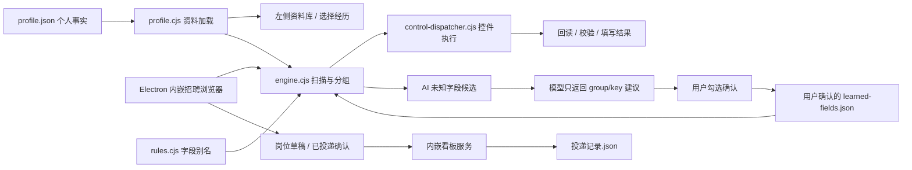

> 历史归档（2026-10-05）：本文记录当时的设计和实现状态，部分结论已过时。当前使用见[使用指南](../../工作台使用与运维.md)，范围见[主计划](../../产品实施Plan-v1.md)，完成状态见[实施台账](../../implementation/实施与审查台账.md)。

# 秋招工作台：实现审计与产品化方案

评估日期：2026-10-02。依据当前仓库的 Electron 主进程、IPC、资料加载、表单引擎、控件执行器、站点适配、Codex runner、看板存储、初始化脚本和测试逐项检查。本文件区分已实现、当前限制和下一阶段方案。

## 1. 产品定位与两种服务

建议定位为**本地秋招资料与投递工作台**：把个人事实整理一次，在不同招聘表单中复用，并管理后续投递进度。规则版是完整基础产品，AI 是处理陌生字段的可选增强。

| 形态 | 用户得到什么 | 依赖与成本 | 当前状态 |
|---|---|---|---|
| 规则服务 | 本地知识库、资料复制、自动填写、回读核验、投递看板 | 不调用模型，不需要订阅；访问招聘网站仍需要网络 | 已实现 |
| AI 增强：用户自带服务 | 配置兼容 Chat Completions 的模型服务，识别规则暂不认识的字段，确认后学习对应关系 | 用户自行配置 API 服务与模型；云端按服务商规则收费；本机模型须自行启动 | 本轮新增 |
| AI 增强：运营方托管 | 软件里登录、购买额度，直接使用受约束的 AI 能力 | 运营方提供服务端、模型采购、账号、计费、额度和运维 | 尚未实现 |
| Codex 开发修复 | 读取完整页面、修改代码、热更新、执行验证 | 本机 Codex、登录权限、较宽的文件和浏览器操作能力 | 历史能力保留，限定 Windows 源码开发模式，默认不启动，不进入安装包 |

“内嵌 AI”应表示软件中具有配置、调用、确认与结果展示流程，不等于安装包捆绑了大模型，也不等于已经建立付费服务。用户自带 API Key 是可用的过渡形态；它还不是“零配置”的付费产品。

基础版保留已有内容、真实事实、人工提交这些共同边界。AI 不能绕过事实校验，也不能把缺资料伪装成控件故障修复。

## 2. 项目结构与运行链路



| 代码位置 | 职责 | 审计结论 |
|---|---|---|
| `秋招桌面助手/src/main.cjs` | 应用、浏览器、IPC、任务互斥、工作区和看板生命周期 | Electron 壳已经存在；本轮补齐安装包运行路径与内嵌服务 |
| `src/preload.cjs` | 向本地界面暴露白名单 IPC | 主进程检查 sender、mainFrame 与本地 UI URL；招聘网页不直接获得本地 API |
| `src/profile.cjs`、`src/rules.cjs` | 单一事实源、资料分类、字段别名 | 运行时只读取 `知识库/profile.json`，其他知识库材料用于来源和历史记录 |
| `src/engine.cjs` | 可见控件扫描、栏目判定、经历身份匹配、规则选择、多轮填写和回读 | 这是基础版的核心，主体为规则，不是大模型自主浏览器 Agent |
| `src/control-dispatcher.cjs` | 根据 DOM 能力选择控件执行分支 | 原生、地区、日期、Layui、Ant、Element、Phoenix、SD、ARIA、Select2 等分支可复用；不保证所有版本兼容 |
| `src/qiyuan.cjs`、`aircas.cjs`、`wjx.cjs`、`zhaopin.cjs` 等 | 特定表单结构与重复记录流程 | 有现场经验价值；历史分支存在假设、硬编码、覆盖行为，需持续清理和做对应页面回归 |
| `src/teaching.cjs`、`learned-fields.cjs` | 人工操作记录与确认后的映射 | 具备学习基础；教学界面脚本存在但并未在当前公开 UI 中默认加载，不能宣传为完整开放功能 |
| `src/ai-mapping.cjs`、`ai-settings.cjs`、`ui/ai-reader.js` | 普通用户的 AI 增强流程 | 本轮新增；仅识别字段含义，个人资料值仍由本地规则读取 |
| `src/ai-reader.cjs`、`scripts/ai-reader-service.cjs` | Codex 代码修复循环 | 是开发工具；不是托管模型服务，也不是低权限用户功能 |
| `秋招看板/网页看板/server.mjs`、`lib/store.mjs` | 本机 HTTP 看板、JSON 存储、新增、更新、冲突处理 | 本轮可由 Electron 主进程启动，使用动态本地端口 |
| `skills/qiuzhao-assistant/` | DIY 求职工作流、简历选材、附件和浏览器操作说明 | 属于知识分享内容，不等于桌面应用已经实现了所有能力 |
| `examples/`、`templates/`、`tools/` | 虚构演示、空白模板、初始化 | 本轮统一复制逻辑；明确指定的个人新工作区使用空白模板 |

### 规则版如何决定填什么

1. 扫描可见控件，读取标签、栏目、类型、已有值与经历身份。
2. 判定所属栏目；学校、学历、公司、项目、奖励等身份用于定位具体记录。身份不唯一时停止套用默认记录。
3. 优先参考用户确认的站点映射，再使用通用字段别名。
4. 从已确认 `profile.json` 取值；处理日期精度、字数、级联路径等限制。
5. 保留与事实不一致的已有内容，交给用户核对。
6. 按控件能力执行正常页面事件，再回读；父级选项可能清空子字段，因此串行执行并重扫，最多三轮。
7. 最终结果分别记录已填写、已有、可填、待处理与不适用。回读通过只证明当前 DOM 值，不证明服务器已保存。

### AI 版如何工作

1. 只从未知、空白、可识别栏目的控件中提取候选；跳过验证码、密码、登录、声明、文件和确认选项。
2. 发送字段名称、栏目、控件类型和通用字段目录。**不发送简历事实值、整页 HTML、Cookie、网址令牌或项目代码**；页面标签文字本身仍可能含个人信息。
3. 模型返回候选 ID、group/key、置信度和解释，不返回答案或可执行代码。
4. 本地验证候选 ID、字段目录、栏目和人工字段约束；低于阈值的建议不展示，非法响应不应用。
5. 用户逐项勾选；保存前重扫页面，拒绝页面或控件已经变化的建议。
6. 保存为 `user-confirmed` 的站点映射，保留旧文件备份；用户再点快速填写，由规则取值和回读。
7. 已确认映射可在关闭 AI 后继续使用，不需要为同一字段每次调用模型。

当前 AI 只解决字段语义识别；缺少个人资料、复杂重复记录、附件、验证码、声明和不支持的控件仍可能需要人工处理。历史整站适配保留自己的流程，之后对用户确认的映射使用通用执行器补填并回读；复杂重复记录仍需要真实站点回归。不要把按钮宣传为“任意表单自动修复”。

## 3. 项目优点与缺点

### 已有优势

- **规则路径已经有实际内容**：不是只有一个 API 调用。扫描、记录分组、不同 UI 控件、重试和回读分支相互配合。
- **本地事实源明确**：个人资料不必每次拼进大模型 prompt；规则版可独立运行。
- **注重事实与经历身份**：没有确切日期时不会补造日期；重复记录不能只靠索引猜测；保留已有冲突值。
- **演示材料完备**：虚构身份和本地练习场有利于教学、回归测试与录屏；不需要为推广向真实招聘方提交演示资料。
- **已有产品闭环雏形**：填写后可读取岗位上下文，用户确认已投递再入看板，记录后续行动。
- **交付可审计**：源码、资料模板、可复用 skill 和上游许可证齐备，适合“讲实现 + 交产品”。

### 主要短板及影响

| 短板 | 具体证据与影响 | 本轮处理 / 后续 |
|---|---|---|
| 源码运行与安装包运行混用 | 原 `main.cjs` 使用仓库相对路径；看板需 PowerShell 和外部 Node | 已改为可写工作区、资源目录和进程内看板；加入打包配置 |
| AI 与开发修复混在一起 | 原 AI 以 Codex 执行并修改本地代码，依赖 Windows 路径、CLI 和热引擎 | 用户 AI 改为受约束的 API 建议；Codex 单列为源码开发选项 |
| 个人场景假设残留 | 启元分支固定硕士、健康、北京海淀、研究方向；智联计划固定薪资和语言水平 | 已去掉这批事实默认值；但历史分支仍需逐站回归，不能据此宣布完全通用 |
| 初次使用门槛高 | 资料仍以 JSON 维护，多份历史材料难区分 | 新增资料设置、新建空白与导入入口；下一步应做可视化资料编辑与校验 |
| 表单仍会变化 | CSS、组件、跨栏和网站校验都可能调整 | 需要多组件练习样例、固定站点回归集、适配维护流程 |
| 功能文案超前 | 看板已使用 JSON，却仍写“同步 Excel”；空面试页写邮箱自动同步 | 本轮改为本地记录和人工补充文案；无邮箱自动同步能力 |
| 数据版本与溯源偏开发者 | `profile.json` 是唯一运行源，历史文件不会自动合并；JSON 没有可视化迁移工具 | 后续做导入预览、来源标记、事实确认时间、备份与恢复 |
| 商业 AI 链路缺失 | 没有账号、付费、额度、模型代理、服务端日志策略 | 属于独立阶段；当前 API Key 模式不能声称已实现订阅 |
| 发布成熟度不足 | 无正式图标、签名、公证、自动更新或跨机器验证矩阵 | 本轮先验证未签名构建；正式公开发行还需发布工程 |
| 测试覆盖偏局部 | 原来主要是少量控件与匹配测试，本地 smoke 不代表线上网站兼容 | 本轮增加 AI 约束、工作区、看板来源约束和完整用户路径 smoke；真实网站兼容性仍待验证 |

不建议现在把引擎微服务化或并发填表。当前串行重扫能应对联动控件，过早拆服务会增加安装、通信和维护负担。应优先做普通用户的资料录入、结果解释与适配回归。

## 4. 本轮已完成的优化

- 增加 Electron Builder 打包命令、Windows NSIS 与 macOS DMG 配置；模型调用走主进程，前端无 API Key 回传。
- 安装包模板和看板通过 `extraResources` 带入；运行数据放用户可写目录，开发模式保留 `.local-workspace`。
- 明确新个人工作区使用空白模板；已有但缺 profile 的目录拒绝覆盖。资料设置允许打开目录、编辑文件、新建与导入，切换时重启应用。
- 看板在主进程启动并随退出关闭，使用系统分配的本地端口；UI iframe 与导入共用该服务，不依赖 PowerShell 或外部 Node。
- 看板拒绝外部 Host 与跨站 API 请求，修正静态目录边界；外部链接在桌面应用中交给系统浏览器。
- 新增可关闭的 AI 设置和字段识别 UI，支持用户自己的云端 API 或本机兼容服务；设置 API Key 用系统 safeStorage 加密，系统加密不可用时拒绝保存密钥。
- AI 建议经过结构与语义约束、人工确认、当前页面重扫、站点规则持久化；关闭 AI 后仍能复用已确认规则。
- AI 请求有 45 秒超时、停止按钮和受控错误输出；网络错误不阻止基础规则继续使用。
- Codex 修复默认不启动，安装包不包含修复脚本；防止运行中的普通用户路径误开启代码修改。
- 去掉一批站点适配中的硬编码个人事实和自动覆盖；对空资料增加保护；资料加载器拒绝非对象记录。
- “检查漏项”使用统一只读扫描，拆掉主进程的巨型站点三元表达式；修复安装包不包含热更新脚本时版本指纹启动失败的问题。
- 看板文案与 JSON 实现对齐，删除未实现的邮箱自动同步暗示。

## 5. 打包与发布

开发者安装依赖后执行：

```sh
npm run setup
npm test
npm run test:smoke
npm run pack       # 当前系统的应用目录，用于调试
npm run dist:mac   # macOS DMG
npm run dist:win   # Windows NSIS，建议在 Windows 构建机运行
```

产物写入 `release/`，已加入 Git 忽略。安装包携带 Electron、Playwright 运行依赖、练习页、模板和看板；最终用户使用安装包无需运行 npm 或安装 Node.js。安装包升级不会把资料写回程序目录。

macOS 应用目录：`release/mac-arm64/秋招工作台.app`。Windows 安装包和 macOS DMG 文件名由 Builder 根据版本与架构生成。开发命令只是配置存在，实际产物与验证情况以[发布验证](../../发布验证.md)为准。

当前未配置发行证书。正式面向普通用户发布时，应配置 Windows 签名、macOS Developer ID 与公证，再做全新账户和系统的安装、首次启动、升级与卸载检查。更新时默认保留个人工作区、浏览器登录资料与 API 设置。不要在公开视频中展示真实密钥、个人资料目录或浏览器登录数据。

打包配置与资源方式参考 [Electron Builder 配置文档](https://www.electron.build/v26/docs/configuration/)，密钥存储参考 [Electron safeStorage API](https://www.electronjs.org/docs/latest/api/safe-storage)。本仓库固定 Electron 44；升级跨主版本时需要复查 safeStorage API，不能只改版本号。

## 6. 托管 AI 服务的具体建设方案

桌面端应复用当前 `suggestMappings` 的受约束输入和输出；服务端提供兼容代理或专用 `/v1/form-mappings`。不要把运营方模型密钥塞进安装包。

最小链路：桌面登录 → 服务端验证用户令牌 → 检查额度和单次请求大小 → 调模型 → 校验字段映射 → 扣费或扣额度 → 返回建议。客户端仍再次校验，并由用户确认。

第一版必要模块：

1. 用户账号、可撤销登录会话与设备管理。
2. 套餐和余额：按请求/点数/秋招季提供可解释配额，显示消耗，预设成本上限。
3. 模型代理：运营方密钥只在服务端，限流、超时、模型故障降级到规则版，失败请求处理退款/额度恢复。
4. 请求幂等：重复点击或网络重试不能重复计费；扣费依据实际成功的计费事件，不能只在前端计数。
5. 内容与日志最小化：默认不持久化用户字段正文或个人事实；若以后加入 JD / 简历改写，应单独说明需要上传什么、何时删除。
6. 可观测性：统计请求成功率、耗时、模型开销、建议采纳率和投诉原因，避免用“填了多少字段”代替正确率。
7. 维护责任：账号和支付投诉、模型可用性、站点改版、隐私与数据处理说明都需要长期负责人。

付费价值可围绕“无需配置模型服务、持续适配、资料录入更省事、及时支持”建立。不要承诺 AI 能自动解决个人事实未知、验证码或任意网站。

## 7. 下一阶段优先级与验收

| 阶段 | 具体工作 | 完成标准 |
|---|---|---|
| 首发前 | 可视化资料编辑、导入预览、备份恢复、清晰新手引导 | 新用户无需编辑 JSON，能建个人资料、填练习页、查看回读与导入看板 |
| 首发前 | 统一旧站点适配的事实源、保留冲突与人工字段策略；验证 AI 学习规则在专用分支中的补填 | 每个支持站点有脱敏本地结构样例，空资料不崩溃、不填固定事实、不覆盖冲突 |
| 首发前 | macOS/Windows 打包、签名、安装与升级 | 全新机器无需开发环境可启动；升级保留资料与设置 |
| 小范围试用 | 招募用户、记录失败原因、扩展页面回归集 | 区分识别失败、资料缺失、执行失败、保存失败；实际人群数据支持推广表述 |
| AI 商业试用 | 服务端账号、额度、模型代理、支付与错误恢复 | 未登录不能消费运营方额度；客户端不含运营方密钥；重试不重复计费 |
| 后续增强 | 用户确认下的简历选材/JD 匹配、规则更新渠道、面试材料 | 选材只复用可追溯事实；模型改写经用户确认；更新可回滚 |

建议跟踪：规则字段正确填充率、最终回读通过率、已有值误覆盖次数、经历错配次数、人工纠正次数、AI 建议采纳率、每次成功辅助的模型成本、填写总耗时。当前没有真实用户样本，不能给出“节省 X%”“所有网站成功率 X%”之类结论。

## 8. 推广视频：知识分享与产品演示

建议先交付“免费资料库与规则填写能独立使用”的事实，再展示 AI 能增加什么。可以录一个 4–6 分钟视频，具体时长按素材调整。

| 顺序 | 画面与操作 | 应讲清楚的实现 |
|---|---|---|
| 开场 | 同一份教育、实习和项目在不同表单反复填写 | 痛点是重复整理和容易漏项；工具不代替岗位判断 |
| 资料 | 展示虚构知识库与左侧分类，复制一段完整正文 | 个人事实统一存在本地 profile，不让模型临时猜答案 |
| 规则演示 | 本地练习页快速填写，展示日期、下拉与长文本 | 字段扫描 → 栏目/经历匹配 → 控件执行 → 回读；本段不调用模型 |
| 边界演示 | 展示验证码、未确认日期或已有冲突 | 解释为什么保留待处理，比宣称“一键全部完成”更可信 |
| AI 演示 | 一个人工改名的陌生字段；识别 → 勾选 → 填写 | 展示发出的元数据与返回的 group/key，解释 API Key 或本机服务需自行配置 |
| 复用 | 关闭 AI 再填同一个已学习字段 | 学习的是对应关系；后续可以按本地规则复用 |
| 投递闭环 | 展示用户确认后的看板导入和下一步行动 | 填写与实际提交分开；不把草稿计为投递 |
| 结尾 | 安装包入口、开源仓库、模板与实现说明 | 用户可以直接用软件，也可以按教程 DIY；托管订阅若未上线就标注计划 |

可以公开讲解规则引擎、JSON 知识库、IPC、AI 输入输出约束和打包方式。教学版用本地模拟服务说明 AI 链路；真正云端演示需配置可用模型服务后再录制，并明确服务商费用。不要用模拟响应的录屏暗示已连接生产大模型。

## 9. 本次工作的边界

这次完成了源码级审计、首批产品化修改、规则与受约束 AI 两条路径、macOS DMG 与 Windows NSIS 构建及本机验证。macOS 打包应用已直接运行，Windows 安装运行仍待真机验证。它还不是完成了签名发行、所有站点适配、可视化资料编辑、真实模型兼容验证或收费服务。剩余范围可以按第 7 节逐项验收，而不是继续往同一个“AI读取”按钮里叠加所有能力。
