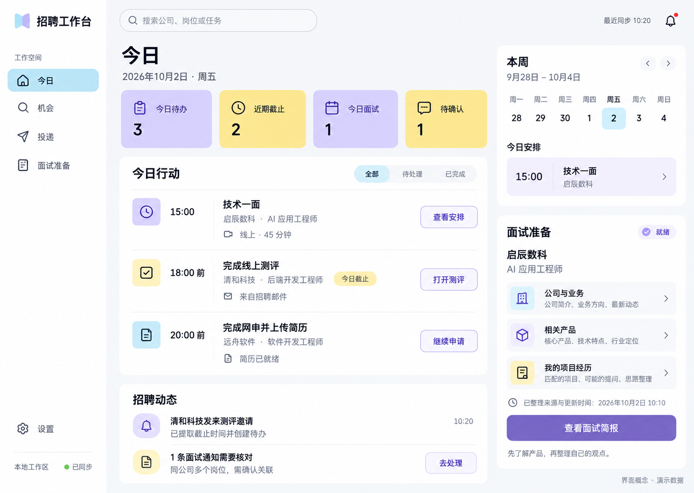

# 招聘工作台 · 产品实施 Plan v1（交互修订 v7 · 基于视觉 v4）

> 文档定位（2026-10-05）：本文件是产品范围与验收约定。下文的“本轮仅修订 Plan”等叙述属于方案形成时的背景；后续实施已发生，当前完成状态以[实施台账](implementation/实施与审查台账.md)为准。

日期：2026-10-02。状态：**视觉方向已认可；本次业务修订供审阅，可直接修改**。

本文件是后续开发的主计划，整合此前功能与 UI 讨论。本轮只修订 Plan；沿用用户已认可的浅彩“今日”页概念图，应用代码不在本轮修改。后续将同一视觉语言应用到真实网申浏览器、面试准备和设置等页面。概念图不代表功能已经实现。v7 更新了颜色语义、月历与多场面试卡片；下方 v4 图片尚未同步这些变化，具体交互以本文件为准。

## 今日页概念图 v4（用户参考图浅彩风格，方向已认可）

本版通过内置 ImageGen 生成，并实际附入用户提供的 SchoolHub 参考图片，参考其浅紫、奶油黄、天蓝色块，白色圆角表面和轻量侧栏。保留招聘工作台的四个主入口与任务主线，不复制学校管理内容、猫头鹰 Logo 或无关图表。概念中 Logo 改为天蓝/浅紫的轻量折页图形，后续完善正式资产。

图中的公司、日程、同步和面试资料均为演示，尚非运行中的应用截图。[用户参考图](design/用户参考-SchoolHub.png)与[完整生成提示词](design/招聘工作台-浅彩参考-v4-prompt.txt)已保存。历史方向保留比较：[蓝白 v1](archive/design/今日页概念-v1.png)、[深松绿 v2](archive/design/招聘工作台-今日页概念-v2.png)、[苹果风 v3](archive/design/招聘工作台-今日页苹果风-v3.png)。本轮不修改业务实现，后续落实页面和品牌资产。

## 0. 一页决策摘要

| 项目 | v1 决定 |
|---|---|
| 产品定位 | 帮用户发现招聘机会、完成真实网申、跟踪后续进度并准备面试的桌面工作台 |
| 每日默认入口 | 今日：具体行动、截止与日程、信息变化、待处理问题 |
| 全局导航 | 一条侧栏：今日、机会、投递、面试准备；底部设置 |
| 个人资料位置 | 设置 → 个人资料与简历；分我的条件/发现偏好，首次引导连续设置 |
| 填写方式选择 | 同一真实网申页面提供「普通网申」与「智能辅助 · 付费」；默认普通，可按需切换 |
| 普通网申 | 规则填写、附件上传、回读后允许滚动检查与直接手改；不依赖付费 AI |
| 智能辅助 | 用户选择疑难字段并确认消耗后，AI 提议修改；审核采用，不保证所有控件可处理 |
| 面试价值 | 公司/产品检索与岗位定制简报为付费 AI 能力；日程、笔记和复盘手工维护保留基础可用 |
| 每日发现 | 方案组内同时满足、组间任一满足；个人条件核验 + 高召回分层推荐；区分新开放与存量补查 |
| 个人管理闭环 | 候选机会 → 用户选择 → 待投递计划 → 申请草稿 → 已提交与后续事件；公司关注独立维护 |
| 第一张概念图 | 今日页，单一完整界面，浅紫/奶油黄/天蓝、白色轻圆角表面、行动优先；不把全部功能堆入一张图 |
| 首个可用里程碑 | 资料/PDF 管理 → 导入整理 → 真实浏览器填写与上传 → 保存当次投递快照 |
| 在线范围 | 本地运行时服务先完成；关机后持续同步与推送属于单独的云端阶段 |

## 1. 产品要解决什么

用户每天打开软件，应立即知道：今天做什么、哪些公司有变化、申请到了哪一步、下一场面试如何准备。个人资料只需建立一次，后续按需更新；岗位、日期和进度尽量从真实来源自动获得。

目标用户为同时申请多家公司、需要填写重复表单并管理测评和面试的求职者。以桌面端校招为已有基础，发现偏好扩展为企业求职、考公/事业单位招录、考研等可并行路线。各路线的信息源与流程分别验证，不把企业招聘的覆盖承诺直接套用到招录或招生；不要求用户了解 JSON、模型调用或站点适配。

成功标准：用户能从简历导入一直走到申请跟进；同一信息不反复手录；待办不漏、不重复；面试材料与本人实际经历和目标岗位相关。不是以按钮数量、AI 输出长度或统计卡片数量评价完成度。

## 2. 当前基础与实际缺口

| 状态 | 范围 |
|---|---|
| 可复用 | Electron 桌面壳、真实网页视图、规则填表、扫描与回读、个人 JSON 资料加载、AI 字段映射、自配模型服务、本地岗位增改/看板、打包与已有测试 |
| 需要重做或升级 | 两入口 UI 和常驻资料栏；一岗位一组日期的数据结构；资料编辑入口；默认练习页；岗位草稿与投递状态的关联方式 |
| 尚未实现 | 简历文件导入/AI 整理、资料 GUI、PDF 资产与版本、自动上传附件、多事件任务、邮箱同步、主动提醒、公司监控、自动面试简报、托管账号与模型服务 |

当前真正的浏览器已经存在；需要把它改成正式任务的主体，并补齐网站执行可靠性。练习页保留为帮助与回归样例，不再是产品默认首页或正式交付的替代品。

## 3. 最终功能范围

### F1 · 个人资料与文件基础

- 个人资料分为「我的条件」和「发现偏好」两个页签：前者保存用于网申与资格匹配的事实，后者保存想看什么、如何组合条件及如何接收推荐。两者在首次引导中连续设置，之后可独立修改。
- 我的条件包括已确认的学历、专业及必要的专业代码、毕业时间、经历、技能、证书等；针对所选路线再按需补充资格字段。不确定或未填写保留未知，不强制收集无关信息。
- 发现偏好不写入招聘网站，也不能反向改写个人事实；例如「想做技术岗」不等于「已有技术岗经验」。修改事实后重算资格，修改偏好后重算推荐并补查存量。
- 导入 PDF/DOCX；自动保存原件、识别文本；扫描 PDF 进入 OCR/视觉解析分支。
- AI 整理基本信息、教育、实习、项目、校园经历、奖励、语言、技能与求职意向，保留原文和来源定位。
- 首次导入预填资料表单，集中核对后采用；后续导入展示新增、冲突、重复和未提及项，支持撤销合并。
- 软件内编辑资料，不要求手改 JSON；未知日期保留精度，不补造事实。
- PDF 预览、文件分类、语言/用途标签、默认简历、岗位绑定版本、历史使用和归档。
- 结构化资料、原文件版本、单次投递快照分别维护。资料编辑不会静默改写 PDF，默认文件更新不改变过去投递。

### F2 · 个性化机会发现、公司关注与待投递计划

- 偏好采用可保存的多组搜索方案，支持路线、单位性质、岗位方向、城市、行业、关键词、排除项与通知偏好。学历/专业/届别等事实读取「我的条件」，不要求用户重复填写。条件逻辑与高召回策略见 F2.1–F2.3。
- 每日发现两类机会：有明确开放日期依据的「新开放」，以及当前仍可申请、但用户尚未收录的「补充发现」。首次发现时间不等于开放时间；日期不明标「新发现 · 开放时间待核实」。
- 「尚未收录」按当前用户的收藏、计划和投递记录判断，不能只查公共岗位库；偏好变化后重算，已忽略项按用户设定暂不重复推荐，重大变更可重新提示。
- 匹配展示符合条件、差距及未知项；资格信息不足显示「待核实」，不能承诺一定可投。开放状态需官网核验，无截止/滚动招聘/关闭/来源失效分别呈现。
- 支持链接导入、公司清单导入和搜索。跨来源归并公司、岗位编号、招聘批次与地点，保留全部证据；不同批次或职位不能误合并。
- 关注公司与选择岗位独立：用户所有选定公司进入关注清单，逐个显示已接入、待接入、需登录或核验失败；不支持的公司仍保留并提供手动核验入口，不虚报全量监控。
- 用户可多选公司/岗位「加入待投递计划」，设置优先级、计划申请日期与提醒，进入「投递 → 待投递计划」。只有公司没有岗位时建「待选岗位」计划项，不伪造岗位或申请记录。
- 来源选择、覆盖率和每日检索可行性必须通过第 7.1 节调研门槛；搜索结果只作线索，不以模型记忆生成招聘事实。

#### F2.1 · 偏好设置：清楚表达“同时满足”和“任一满足”

不同维度分开呈现，避免把考公、考研、私企、技术、销售平铺成一组含义不明的标签：

| 维度 | 示例 | 作用 |
|---|---|---|
| 发展路线（可多选） | 企业求职、考公、事业单位招录、考研 | 决定搜索的信息类型、来源和后续流程 |
| 单位/机构属性 | 私企、国企、外企；招录机关/事业单位；院校 | 根据路线显示可用条件，不把私企等同于路线 |
| 岗位/研究方向 | 技术、销售、产品；报考专业/研究方向 | 岗位与招生使用各自词表，技术岗不能套到考研项目 |
| 范围与偏好 | 城市、行业、工作方式、学校/公司、关键词 | 可标为必须满足、优先考虑或不考虑 |
| 资格事实 | 学历、专业、届别、证书及路线需要的其他条件 | 从已确认资料取值，与公告要求比对；不是兴趣标签 |

默认用“方案卡”表达逻辑，不要求用户学习 AND/OR：**同一维度多选为任一；一张卡中的不同条件同时满足；多张卡之间任一满足。** 每张卡显示自然语言摘要，并提供「再加一种选择」。空维度表示不限；非法或互斥组合就地说明。不能把全局偏好悄悄变成每张卡的必选条件；用户明确设定的全局限制才应用于所有卡，并固定显示。

| 用户意图 | 可读的搜索方案 | 逻辑示意（实现约定） |
|---|---|---|
| 只看考公中的技术岗 | 一张卡：考公，并且岗位方向为技术 | 考公 AND 技术 |
| 考公技术岗或私企销售岗都可以 | 卡 A：考公 + 技术；卡 B：企业求职 + 私企 + 销售 | (考公 AND 技术) OR (企业求职 AND 私企 AND 销售) |
| 考公、私企都可以，技术或销售都可以 | 卡 A：考公 + 技术/销售；卡 B：企业求职 + 私企 + 技术/销售 | (考公 AND (技术 OR 销售)) OR (企业求职 AND 私企 AND (技术 OR 销售)) |
| 考公、私企、技术、销售任意命中都可以 | 明确选“任一即可”，拆为考公、私企、技术、销售四张卡，并提示范围很宽 | 考公 OR 私企 OR 技术 OR 销售；仍受明确全局限制约束 |
| 只看考研，或同时保留求职 | 考研卡填写院校/专业/地区；需要求职则另建求职卡 | 招生方案 OR 求职方案，不要求一个机会同时满足两条路线 |

输入含糊标签时提供以上组合预览供选择，不能由 AI 默默决定用交集还是并集。提供常用模板、标签多选和摘要编辑；保存前展示样例命中与不命中原因。实时数量无法准确获得时显示“已加载样本”，不虚构全网命中总数。自然语言输入可作为后续辅助，但必须转换为可见、可编辑的方案卡后才生效。

考研对应招生信息、院校/专业、报名与相关节点，不能伪装成公司岗位；考公/事业单位对应公告、职位及报名节点。没有接入的路线保留偏好并标记“尚未支持/覆盖有限”，允许链接导入与人工计划。界面按机会类型显示“公司/单位/院校”及“申请/报名计划”；后台也按类型分流，不暗示现有企业网申执行器已支持所有路线。

#### F2.2 · 高召回匹配：多找相关信息，再解释差异

产品默认采用高召回，优先减少遗漏，同时依据真实个人条件筛选。用户主动设定的搜索范围仍然有效，高召回不能把“只看考公”扩成私企推荐。

1. **多路找候选**：按每张方案卡分别检索，结合岗位别名、专业/方向相关词、关键词与语义检索，汇总去重；同时查新开放与仍开放存量。语义扩展不作为资格认定依据，不因职位标题不同就漏掉职责相关机会。
2. **核对事实与资格**：逐项记录符合、明确不符合、未知或来源冲突。只有可靠公告与已确认个人事实能证实不满足强制资格，或违反用户明确排除项时，才从默认推荐中排除；低置信提取、缺字段和模糊专业对应进入待核实。条件允许多条资格路径时，满足任一路径即可，不能误按全部同时满足。
3. **保留边缘相关结果**：软偏好不符、经验略有差距、相邻方向或资格待核实的结果保留，分别解释。人工修正高于模型判断；不设置一个无法解释的总分阈值批量删掉候选。
4. **分层排序而非少量截断**：先展示符合度较高且临近截止的机会，再给“值得看看”和“资格待核实”；完整相关列表支持翻页和筛选。首页摘要/通知长度上限只限制展示，不丢弃未展示候选。
5. **反馈与复查**：支持“不感兴趣/条件不符/已看过”及原因；一次跳过不推断永久排除整个行业。被过滤记录可查看原因、纠正事实并恢复；资料、公告或偏好变化触发重新匹配。

每条推荐回答：命中了哪张方案、哪些个人条件符合、哪里待核实、为何现在推荐。对于招录/招生等资格细则，以当前官方原文核验，模型不自行推定专业等价、年龄界限或报考资格。界面使用“初步符合/待核实”，不承诺报名资格最终通过。

#### F2.3 · 快速浏览与每日价值呈现

- 每张机会卡展示公司/单位/院校 Logo、名称、岗位/项目、地点、路线、单位性质、方向、截止及来源核验状态；优先显示 3–5 个关键标签，其余展开。Logo 取自可核验来源并保存出处，缺失用名称缩写占位，不生成貌似官方的标志。Logo 仅帮助识别，文字与标签必须可独立理解。
- 列表顶部提供路线、方向、城市、单位属性和匹配层级标签筛选；可在“全部方案”和单个方案间切换。多个方案命中同一机会只展示一条，标注全部命中方案。
- 同一单位有多个岗位时聚合为一张单位卡，可展开逐岗比较和加入计划；公司数、岗位数分别统计。招聘批次、转发文章、重复来源不能当作多个新公司。
- 每日摘要默认聚合发送一次（用户可调整频率、渠道或关闭），区分“新开放”“新发现的在招机会”“补充找到的存量机会”和“关注变化”；推荐分类按顺序归入唯一分组：有依据且在本次新增时间窗开放的归新开放；开放时间未知的归新发现在招；已知早于时间窗开放的归存量补充。无法确认仍开放的进入待核实，变化单独计事件。提供查看全部、加入计划和不感兴趣。
- 单位首次向该用户推荐才计为“新发现单位”；已见公司新增岗位显示“熟悉公司有新岗位”。不能把当天首次采集标成当天开放，也不为追求数量重复推旧内容；当天少或没有新机会时真实显示，并保留仍可申请的列表。
- 默认通知只发送一份摘要，优先明确相关的内容，其余可一键查看；高召回体现在完整候选集，避免每个岗位单独轰炸。临近截止等提醒沿用独立设置；外部发送依赖用户启用的渠道与授权，未配置时在应用内展示。

### F3 · 真实网申与自动附件上传

- 从机会/投递进入真实招聘官网，支持地址、导航、登录和页面加载状态。
- 默认「普通网申」：使用选定资料和确定规则自动填写，完成后进入「待用户检查」。用户可滚动查看整页，直接修改任何字段，不要求付费才能修正。
- 可选「智能辅助 · 付费」：用户主动选择未填/疑似错误字段，查看处理范围与额度消耗后启动。先展示建议与事实依据，用户采用后写入；结果仍可手改。普通模式不暗中调用付费 AI。
- 智能辅助只处理本次选定范围，不全页重填；切换模式保留当前值、已上传附件和人工修改。自动执行时人工输入触发暂停，重新扫描后再继续。
- 缺失事实要求用户补充；验证码、登录、网站故障和不支持的控件保留人工路径。现有 AI 仅做字段映射，语义纠错与控件执行需另行实现并验证。
- 自动上传已绑定简历 PDF，校验文件用途、类型与大小，等待网站响应并核验。
- 支持网站“先上传解析简历、再填写”的顺序，不让网站后续解析静默覆盖已核对内容。
- 显示当前步骤、待处理问题、开始/暂停/继续/接管；接管后停止自动写入，继续前重扫。
- 区分字段已填、附件已接收、页面已保存、申请已提交。最终申请提交由用户确认；无回执不自动计为成功。
- 记录当次资料版本、附件哈希、岗位与提交证据，草稿可继续。

### F4 · 个人投递计划、进度、事件与待办

- 「投递」是个人管理入口，分「待投递计划 / 进行中 / 已结束」。计划包含公司、可选岗位、优先级、计划日期、来源、资格与截止状态，可改期、移除或开始申请。
- 从计划开始填写才创建/关联申请草稿；只有提交证据或用户明确标注的手动登记才进入已投递。计划数、草稿数和成功投递数分开计算。
- 提交后完成对应计划任务并转入进度跟踪；重复点击或多来源选择不重复建计划。关闭/截止/资格变化先标风险，保留用户计划并允许调整，不自动删除。

- 一次投递可同时拥有测评、预约、正式面试、补材料和 Offer 回复等多个事件和任务。
- 时间线记录事件来源、变更、完成依据和人工修正；不把整个申请压成一个“下一步”文本。
- 新建、完成、取消、延期、改期；支持日历、任务列表、临期和冲突展示。
- 今日待办按任务去重计数，逾期和待确认单列。预约截止与面试开始时间分开。

### F5 · 邮箱同步与信息自动更新

- 首版支持一种目标邮箱服务商，随后扩展；提供只读连接、同步范围、状态、断连恢复和解绑。
- 增量拉取招聘邮件，去重；规则模板优先，AI 解析复杂正文，关联公司/岗位/申请编号。
- 明确且通过校验的通知自动创建/更新事件；改期、取消、补材料更新对应任务和提醒。
- 多岗位关联不清、日期矛盾或未知模板等进入待确认箱，原文可查看，用户修正可保留。
- 读取、理解、确认、任务完成是不同状态；不能将“邮件已读”当“测评已完成”。
- Offer 日期区分发出/收到、回复截止、入职日期；没有依据时不猜录取时间。

### F6 · 今日行动与提醒

- 首页优先展示具体下一步：完成测评、继续申请、预约面试、阅读面试简报。
- 列表与月历联动，支持按日查看安排、完成行动和结果；阶段色固定，完成热力与计划密度可切换。多场面试通过卡片滑动及完整列表访问；最近变化可直达岗位，异常可直接处理。
- 可配置每日摘要、截止前与面试前提醒；已完成或取消任务停止提醒，改期撤销旧提醒。
- 持久化调度、重启补偿、休眠恢复、去重和发送记录；展示实际同步健康度。
- 本地版明确依赖应用运行；用户要求全天在线时接云端调度与选定推送渠道。

### F7 · 面试准备与复盘

- 按一场面试组织简报，关联该轮次、岗位和已确认个人资料。
- 公司业务、目标用户、相关产品、入口、公开动态及岗位理解的联网检索和综合作为付费 AI 服务；用户确认生成/刷新范围及消耗后执行。
- 新面试事件只自动建立准备入口和提醒，不自动扣费。可后续提供明确开通的自动生成选项，须限定场次、额度与预算；首版默认关闭。
- 提供产品体验任务、个人项目/实习的对应证据、准备重点、可交流观点及问题。
- 关键事实带来源和时间；公司/业务线/团队之间的推断标为待核实，缺资料不生成假结论。
- 用户可记录实际体验和面后复盘；刷新简报保留用户笔记。
- 不替用户声称使用过产品或经历过未发生的项目。输出帮助理解，不提供无依据的背诵材料。

### F8 · 服务设置与数据管理

- 个人资料与 PDF、邮箱、模型服务、提醒、账号/用量、工作区、备份恢复集中在设置。
- 保留现有用户自带 Key 作为高级兼容模式；面向普通用户的付费智能服务需托管能力，运营方模型 Key 只在服务端。两种模式明确区分用量与账单。
- 数据升级有备份和版本，跨平台安装升级保持个人数据完整。
- AI 关闭时仍能手工维护资料、用规则填写、管理已有任务与提醒。

### F9 · 基础能力与付费服务

以下是产品分层方案，具体价格和套餐待成本实测后确定，不代表当前已有支付功能。

| 层级 | 能力范围 | 用户触发方式 |
|---|---|---|
| 基础能力（建议免费） | 手工资料/PDF 管理、规则填表与上传、整页检查和手改、收藏/计划/进度、已有资料与笔记查看、本地提醒 | 随时使用，不要求购买 AI |
| 付费智能填写 | 选定字段的语义理解、映射与有事实依据的纠错建议 | 主动切换智能辅助，确认本次范围与消耗 |
| 付费面试准备 | 公司/产品公开资料检索、岗位与经历关联、简报生成/刷新 | 按场次生成，刷新视为新任务，显示消耗后确认 |
| 定价待验证 | 简历 AI 整理、复杂邮件解析、扩大检索频率/公司数、全天云端监控 | 独立核算成本后决定免费额度或套餐；不默认无限量免费 |

建议先以按次/额度包验证付费意愿，再考虑订阅包含额度；最终金额须基于有效结果成本、失败率和用户试用确定。基础人工修正不能被付费墙阻断；公司发现与监控是否收费另行验证，不因含有搜索就全部默认为付费。

付费前显示用途、输入范围、预计或固定额度及上限；后端校验权益并预留额度，同一任务重试使用幂等标识。仅对事先约定的成功交付结算；无可用结果、取消前未产生交付或服务失败释放预留，扣费异常提供返还记录。部分结果是否收费须预先定义，未定义时不结算。保存任务、用量、结算与恢复状态，禁止静默超额或失败重试重复扣费。

余额不足、取消购买或服务不可用时，保留页面已填值并可继续普通网申。到期后仍能查看/导出已生成简报与个人笔记；新的生成/刷新按权益执行。自带 Key 的供应商账单按其规则处理，不承诺由平台退还外部费用，也不重复收取平台托管推理费。

### 本计划不默认纳入首版

无限公司覆盖、所有网站保证自动完成、未经确认的最终提交、自动参加测评/面试、完整简历排版生成器、代用户发送邮件、手机应用、多端实时协作。若后续加入，应单独定义工作流与验收，不混入已有功能承诺。

## 4. UI 结构与交互约定

### 4.1 一级导航与页面职责

| 入口 | 主要内容 | 核心操作 | 次级区域 |
|---|---|---|---|
| 今日 | 今日行动、最近变化、近期面试、异常 | 做下一件事 | 列表/日历；待确认抽屉 |
| 机会 | 新开放、补充发现、关注公司、来源与期限 | 调整偏好、关注、加入待投递计划 | 公司详情、岗位档案、覆盖状态 |
| 投递 | 待投递计划 / 进行中 / 已结束 | 排期、开始/继续填写、处理任务 | 投递时间线、材料版本、来源 |
| 面试准备 | 场次、已有简报与生成状态 | 付费生成/刷新、阅读、记录体验 | 公司/产品/岗位/经历/复盘页签 |
| 设置（底部） | 资料与简历、连接、服务、提醒、数据 | 低频维护 | 完整表单和 PDF 管理页 |

只保留一条全局侧栏。页内用页签、列表和返回路径；证据、冲突、文件选择使用临时抽屉，不常驻第二个大型面板。统一通知入口连接待确认箱，邮箱原文挂在事件来源下。

### 4.2 今日页：阶段色、月历与多场面试

- 窄侧栏约 208px，正文留足空间；选中“今日”，底部设置。
- 顶部标题、日期与轻量搜索/通知；显示真实同步状态。
- 仅保留今日待办、近期截止、今日面试、待确认四块紧凑摘要，支持点击筛选。摘要以统一白色/中性浅底为主，只有有语义的图标或标记着色，不按位置轮流涂紫黄。
- 主区域按时间与紧急程度排列任务，每行明确公司/岗位、动作、时间、状态和来源。
- 右侧上方固定为完整月历，下方为所选日期的多场面试准备卡片；月历、卡片与主行动列表联动，默认选今天。主体下方招聘动态区分新开放与补充发现，并支持加入计划。待投递计划到期进入行动列表，不计为已投递。
- 无任务时给下一步入口；同步失败有状态，不能把“未收到数据”画成“今天无事”。

#### 4.2.1 · 颜色必须有固定含义

将「事件阶段」「处理状态」「行动数量」分为三套编码：阶段用标签色，状态用文字/图标和少量状态色，月历数量用单色深浅。不能同一个紫色既随机装饰、又表示一面、又表示逾期。全应用的任务列表、日历详情、面试卡片与时间线使用同一映射。

| 事件/阶段 | 颜色方向 | 显示约定 |
|---|---|---|
| 申请/材料提交 | 中性灰蓝 | 标签写申请、补材料等具体动作 |
| 测评/笔试 | 天蓝 | 线上/线下为次级属性；线上测评始终使用测评色 |
| 一面 | 浅紫 | 显式标注「一面」，技术/业务/HR 为独立标签 |
| 二面 | 中紫 | 与一面同色系，饱和度或强调线更深 |
| 三面及以上 | 深紫 | 标注实际轮次；不无限增加难以区分的颜色 |
| 终面（来源明确） | 最深紫色强调 | 明确标「终面」；二面就是终面时显示「二面 · 终面」 |
| Offer/录用通知 | 青绿 | 表示流程结果，接受、待回复、放弃用状态文字区分 |
| 轮次未知/其他行动 | 中性灰 | 不根据面试官职级或顺序猜轮次 |

紫色梯度表达同一面试流程的阶段递进，不能代表成功率或候选人能力，也不意味着所有企业都会经过全部轮次。跳轮、加面和流程回退按实际证据显示，不为了颜色递进改写业务状态。考研/招录有自己的考试、复试等文字类型，未建立对应关系时用通用考试/面试类别，不硬套企业一面二面。

保留 v4 的浅彩气质：阶段色用于小标签、左侧细线或图标底，正文保持清晰。奶油黄固定用于待确认/需注意，红色仅提示逾期/冲突，完成使用勾选标记；状态不覆盖阶段标签。今日待办与近期截止摘要保持中性，今日面试可用面试类别图标，待确认使用黄色提示。具体色值、深浅层级及文字对比在组件实现时校验；始终同时提供标签、数字或图标，不能只靠辨色操作。

#### 4.2.2 · 月历：既看到安排，也看到实际积累

- 完整显示所选月份的 7 列、5–6 行日期网格，支持上月/下月、年月标题与回到今天；邻月日期弱化但可点选。今天使用细边框，选中日期使用独立外圈，不遮住活动深浅。
- 默认「已完成行动」热力：使用统一青绿由浅到深，0、1、2–3、4–5、6+ 件五档，并显示图例。深浅表示该日实际完成量，与阶段紫色无关，不代表成败或努力程度的优劣；未来日期无完成热力。
- 可切换「计划安排」：以灰蓝单色深浅显示每日已排期任务量，沿用同一数量分档、清楚显示当前模式。将“安排很多”与“实际做完很多”分开，避免堆待办就增加成就值。默认完成热力上用小圆点标记当天仍有安排，详细数量在点选后显示。
- 点某一天，主区域标题变为「10 月 2 日的行动与结果」，按计划、已完成、未完成/改期分组展示动作、公司/岗位、发生时间及结果；可展开原始证据与复盘。提供回到今天，不能让历史页看起来仍是今日。
- 完成的统计单位是去重后的实质行动：一次正式申请、完成测评、参加一场面试、完成一项明确准备任务等。打开软件、看卡片、收到邮件、AI 后台生成和新建待办不计完成；一次动作不会因多个来源或多个关联任务重复加分。
- 用实际完成时间归日，迟补记录可填写真实发生日期；自动确认与用户手动标记均可计入，但保留来源。撤销误标重新计算；未来日期不能标为已完成。改期保留旧计划历史，新安排移到新日期，取消不计完成；过去日期详情可查看当时的安排及后续变化。
- 月历下方用一行轻量记录呈现「本月完成 X 项 · 有行动 Y 天 · 自首次记录已过 Z 天」，支持查看累计历史。Y 为有至少一次完成行动的去重日期数，Z 为首次有效行动日期至今天的含首尾自然日；无记录时显示开始记录。历史导入标明来源，不声称导入前一直使用本系统。
- 同一用户选定的时区决定归日；原始时间和时区保留。未启用记录、同步失败或历史未覆盖的日期显示未知/未覆盖，不能全部染成“0 行动”。手工记录与已知同步覆盖范围也要区分，热力只反映已记录行动，不声称完整还原用户的努力。

月历的成就感来自真实积累，不以连续打卡惩罚休息日。默认仍优先提示今天的紧急行动；查看历史或其他月份不会消除今日未完成提醒。

#### 4.2.3 · 多场面试准备：可滑动且不隐藏待办

- 区块标题显示「今日面试 · 3 场」或所选日期，附「查看全部」。一场面试一张卡；同公司两轮也分别呈现，不能按公司合并而漏掉场次。
- 默认按开始时间排列，优先定位下一场未结束面试；已结束场次仍可在该日查看并进入复盘。每卡包含 Logo/公司、岗位、轮次色标签、时间/地点或方式、准备状态与主动作。
- 横向滑动切换，露出下一张卡的一小部分，并提供左右按钮、当前位置「1 / 3」、触控板和键盘操作；不自动轮播。只有一场时隐藏翻页控件，很多场时通过「查看全部」打开按时间排列的完整列表，不无限拉长侧栏。
- 准备状态区分未生成、生成中、可阅读、失败和待更新。未生成显示「AI 准备 · 付费」，已有简报显示「阅读简报」；临近开场优先显示「进入面试」，结束后提供复盘。滑到卡片或切换日期不自动生成、不扣费。
- 今天没有面试时显示「今日无面试」，可另列「下一场 · 日期」而不计入今日场数。跨天、多家公司、同公司多轮、时间冲突和取消均须正确呈现；冲突提示常驻区块顶部，不能因卡片没滑到就不可见。
- 窄窗口下月历与卡片移到主列表下方，保持日期选择与“查看全部”可达；提供列表模式供不习惯滑动的用户使用。首页展示入口，完整准备内容仍在面试准备页。

### 4.2a 机会发现页与偏好入口

机会页顶部显示当前方案摘要和「编辑发现偏好」，下方为筛选标签、单位聚合卡与岗位列表。卡片按 F2.3 展示 Logo/文字/关键标签与匹配解释；用户可切换推荐层级，不因默认折叠看不到完整候选集。首次引导依次填写我的条件、选择路线、建立方案、预览解释、设置每日摘要；可跳过非必要字段，缺失资格提示保留到推荐卡。考研等机会使用院校/项目文案，保持四入口结构。

### 4.3 真实网申浏览器

- 从具体岗位进入，不是全局内容频道。保留“返回该投递”和最近未完成任务入口。
- 网站占主要空间；上方紧凑工具栏显示真实域名、导航、岗位、选中简历、执行控制及「普通网申 / 智能辅助 · 付费」选项。
- 普通填写完成后提示「请滚动检查，可直接修改」，旁边提供非阻断的「仍有不准确？选择智能辅助」入口，不强制弹出购买窗口。
- 智能辅助抽屉展示选中字段、现值、建议值、依据和消耗；应用前核对页面是否已变化，冲突保留用户输入。取消/余额不足可立即返回普通填写。
- 默认不显示全部个人资料或每步技术日志；错误/缺失时可定位字段，抽屉修正后返回。
- 执行中全局侧栏可收窄；用户接管时自动化停止输入，不与用户争夺页面。
- 练习页移入帮助/教学，正式启动后默认今日页。

### 4.4 面试准备页

- 顶部是场次、时间、岗位和准备状态；未生成时显示「AI 准备简报 · 付费」与范围/消耗说明，已有简报显示「阅读简报」，刷新明确提示新消耗。会议临近时优先显示进入会议。
- 默认先给几分钟能读完的重点，不把整篇公司百科铺在首屏。
- 内容按公司业务、相关产品、岗位要求、我的证据和可提问题组织；来源按需展开。
- 单独保留用户体验笔记与面后复盘；来源更新不覆盖这部分内容。

### 4.5 视觉方向（用户已认可，沿用 v4）

名称统一为“招聘工作台”。v4 以用户给出的 SchoolHub 图片为主视觉参考，替代此前深绿色与苹果风方向。参考色：浅紫 `#D7CFF7`、奶油黄 `#F8E481`、天蓝 `#BFEAF5`，基底 `#F7F8FA`，白色表面，正文 `#26292F`，次要文字 `#727780`，关键操作可用深紫 `#6654A1`。浅彩按照 4.2.1 的固定语义用于阶段标签、图标与提示；摘要不再随机交替紫黄，不作为大面积正文背景。12–16px 正文、约 28px 页标题、12px 左右圆角；使用柔和间隔和轻分隔线，避免重阴影及大图表。

本版交互补充：顶部摘要点击后筛选“今日行动”；月历选日期后同步行动/结果列表与当天面试卡片，提供回到今天；任务按钮进入真实测评/申请/安排页面；面试准备的公司、产品、个人经历分别跳到同一简报的对应段落；动态项可展开原文证据。各处均读取同一任务/事件数据，不能出现看板数量与日历不一致。状态同时使用文字标识，浅彩不承担唯一含义；实际对比度、键盘操作及窄窗口布局需实现后验证。

Logo 当前为天蓝与浅紫的抽象折页概念，不复制参考图的学校品牌。实现阶段单独完善矢量、单色、小尺寸版本。生成图的颜色和尺寸不是最终代码参数，前端实现需基于确认稿建立设计变量。

以间距、对齐和细分隔线组织内容；状态同时使用文字和颜色。常用操作在窗口缩放和键盘导航下可达，普通用户界面不常驻引擎版本和内部字段名。

沿用上一轮单张完整今日页图；本轮不再生成图片。图中公司/岗位与数据全部虚构并标注，日期锚定 2026-10-02（周五）；这张图用于确认布局、密度和风格，不代表后台已连通。

## 5. 用户 Workflow

### W1 · 首次使用

打开软件 → 导入简历 → 原件入库与文本解析 → 手动整理或选择有明确额度提示的 AI 整理 → 查看资料/冲突 → 保存 → 选择默认 PDF → 设置求职偏好/关注公司 → 可选连接邮箱 → 进入今日。

允许跳过邮箱/AI，后续从设置补充。文件解析失败保留原件，允许重试或手工录入；不让一个外部服务故障卡死首次使用。

### W2 · 每日发现与加入个人计划

建立偏好 → 在已接入来源中检索 → 官方证据核验与去重 → 分为新开放/补充发现/待核实 → 查看条件和匹配依据 → 用户选择公司或岗位 → 加入待投递计划并设置日期/优先级 → 在「投递」管理。

每天既检查新增岗位，也补查仍开放且用户未收录的岗位；关注公司单独逐家检查。只有公司时先进入「待选岗位」，发现匹配岗位后由用户选择绑定。来源失败显示最后成功核验和原因；空结果不能自动解释为停止招聘。用户可补充链接、纠正匹配与忽略推荐。

### W3 · 普通网申与按需智能辅助

待投递计划/岗位 → 创建或恢复申请草稿 → 打开真实官网并登录 → 选择简历 → 默认普通网申 → 扫描并按网站顺序上传/规则填写 → 回读 → 用户滚动检查与直接手改 → 用户确认保存/最终提交 → 核验回执 → 完成计划任务，进入个人投递进度。

可选分支：发现不准确/未识别内容 → 手改，或选择「智能辅助 · 付费」→ 选定范围、查看消耗并确认 → 获得建议 → 核对采用 → 再次回读与人工检查。切换方式不重新创建申请、不清空当前内容；智能结果不自动提交申请。

页面跳转、会话过期或人工输入时暂停执行；继续前重扫当前值，保护手动修改。上传、保存、提交分别记状态；无回执保留待核验，可由用户明确标记手动登记，不能伪装为网站验证成功。

### W4 · 邮件推进进度

后台增量同步 → 判断招聘通知 → 按公司/申请编号/岗位关联 → 提取事件、时间和行动 → 校验来源与日期 → 明确项更新、歧义项待确认 → 更新投递/任务/提醒 → 今日页呈现变化。

后续改期或取消关联到原事件并撤销旧提醒。重复邮件不重复建任务，晚到的旧通知不回滚新状态。

### W5 · 每日处理

进入今日 → 看具体动作与截止/切换多场面试准备卡 → 打开测评/继续网申/预约面试/阅读简报 → 完成或延期 → 更新任务及实际行动记录 → 月历热力和统计同步。点选任意日期可回顾当日安排、结果与复盘，再返回今天；当日摘要不重复提醒已完成事项。

### W6 · 面试准备

确认面试事件 → 建立准备入口与提醒 → 用户选择付费生成并确认额度 → 检索 JD 与公司/产品公开资料 → 关联真实经历 → 生成可溯源简报 → 用户阅读并体验产品 → 记录观察 → 面试与复盘。

用户不购买时仍可查看场次、手工整理和记录笔记；购买取消不影响面试管理。后续轮次可复用已购材料，新增检索/刷新按新任务显示消耗。默认不因收到邮件、打开页面或新增面试而扣费；自动生成仅能在用户另行开通且预算充足时执行。

### W7 · 后续维护资料

设置 → 上传新版简历或编辑资料 → 差异合并 → 保存新修订 → 按需更换默认 PDF → 新任务使用新版本，旧投递保留原快照。

## 6. 自动化与人工处理的边界

| 自动执行 | 需要处理的例外 | 不能自动假定 |
|---|---|---|
| 原件存档、解析、整理草稿 | 文件损坏、加密、解析歧义 | AI 提取结果一定正确 |
| 明确岗位信息和已验证通知入库 | 多岗位关联不清、日期或来源冲突 | 不存在的截止/录取时间 |
| 使用选定资料填表和上传文件 | 缺资料、附件不符、页面验证、已有冲突 | 字段显示成功等于服务器保存 |
| 任务计算、日历、提醒 | 失联、授权过期、通知权限失败 | 用户收到系统通知就已处理 |
| 已获付费授权的公司/产品检索与简报生成 | 额度不足、官方信息不足、业务关联不明 | 自动扣费、用户使用过产品、团队必定负责某产品 |
| 已接入来源的每日检索与关注检查 | 来源未接入/失效、资格未知、期限矛盾 | 全网无遗漏、首次发现就是今天开放、关注就是已投递 |

AI 输出采用结构化 schema，验证后交给业务服务。提示词、模型置信度不能代替来源证据。所有自动更新保留来源与修订，人工修改具有明确优先级，并能撤销误更新。

## 7. 实现架构与接口职责

### 本地应用

沿用 Electron 和现有真实网页视图；在主进程或受控任务服务中处理文件、解析、浏览器执行与调度，通过白名单 IPC 向自有 UI 暴露功能。招聘网页不得获得任意读取本地文件的能力。

保持单体桌面应用起步，不先拆成多个微服务。分离职责：资料服务、文件服务、浏览器执行器、招聘采集、邮箱连接器、事件任务、提醒、面试简报及模型适配。

### 数据

保留 `profile.json` 为初期已确认个人事实源，用统一服务进行版本校验、原子写入与备份；关联业务数据采用本地数据库，受管目录保存原文件。若以后迁移事实源，必须统一迁移，不能保留两个互不一致的可写主库。

最小实体：Company、Opportunity、UserPreference/SearchPlan、MatchAssessment、CompanyWatch、UserOpportunity、ApplicationPlan、Application、Event、Task、ActivityRecord、Reminder、Asset/ResumeVersion、ProfileRevision、ApplicationSnapshot、Connection/SyncRun、SourceEvidence、SourceRegistry、DiscoveryRun、Briefing/UserNote、AIJob、Entitlement/UsageLedger。

关键关系与状态：

- ActivityRecord 保存去重行动标识、关联任务/事件、实际发生与完成时间、计划历史、结果、证据/手动来源、撤销状态和时区。热力按有效完成行动聚合，安排密度按排期任务聚合；同一面试的事件、提醒与任务不能计三次。阶段类型/轮次与任务状态分开保存，颜色由统一映射派生，不写死在每个页面。

- UserPreference/SearchPlan 独立于 profile.json 保存版本化方案树：组间 anyOf、组内 allOf、同维度多值 anyOf、显式全局约束/排除项及软偏好；禁止将用户文本直接拼成不受控查询。MatchAssessment 保存命中方案、逐项资格状态、排除依据与资料/来源版本，支持解释和重算。
- Company 在发现层扩为 Organization，包含企业、招录单位与院校类型；Opportunity 区分职位/招录职位/招生项目，保留各类专属字段、原文与时间精度。关注和计划关系保持兼容，申请执行按类型路由。
- 推荐记录保存每用户首次展示单位/机会时间、已读/忽略状态、摘要投递与去重标识；新单位数、新岗位数和变更事件分别统计。

- CompanyWatch 保存用户选定公司、接入状态和最近检查；UserOpportunity 保存该用户收藏/忽略/已收录状态，与公共岗位数据分开。
- ApplicationPlan 可仅关联公司，岗位为空时状态为待选岗位；绑定岗位后可待投递/填写中/已完成/已取消。计划日期与官网截止分别保存。
- 同一用户、岗位和招聘批次复用活动计划/申请；不同岗位可独立投递。Application 区分草稿、待核验提交、已提交及后续阶段，保存计划关联和提交证据类型。
- Opportunity 分别保存官网开放时间、平台首次发现时间、最近成功核验时间及证据；DiscoveryRun 记录本轮检查范围、失败与遗漏补查，不以更新抓取时间刷新岗位开放时间。
- 填表字段保存写入来源、人工修改标记与本次扫描版本；AI 建议是待采用草稿，不直接改写个人事实源。AIJob 保存范围、状态与幂等标识，UsageLedger 记录预留/结算/返还；商业用量账本以服务端为准。

### 外部服务

| 服务 | 承担什么 | 选择状态 |
|---|---|---|
| 文本模型 | 简历/公告/邮件结构化提取，字段映射，面试综合 | 复用兼容 Chat Completions 的适配方向，供应商/模型需样本验证 |
| OCR/视觉 | 扫描页与复杂版面读取 | 待验证本地或云端方案，不能假定当前文本接口支持 PDF |
| 搜索与官网采集 | 发现来源、获取公告/产品信息、存量补查 | 先执行 7.1 的来源验证；不假设存在统一招聘 API，供应商保持可替换 |
| 邮箱 | 获取用户授权范围内的新邮件 | 首发服务商待确定，先实现一种完整连接器 |
| 系统通知 | 软件运行时的本地提醒 | 使用桌面系统能力，与 AI 解耦 |
| 自有后端 | 托管模型、账号权益、计费任务与账本；可选持续调度 | 托管付费上线的前置依赖；云端常驻监控可后续建设，Key 不下发客户端 |

当前只有字段元数据的 AI 调用不等于未来的数据范围：简历/邮件解析可能上传正文，OCR 可能上传页面图像；在设置中明确所选模式和处理范围。默认日志不保存密钥、完整简历、邮件正文或带登录令牌的 URL。

### 7.1 招聘来源调研与覆盖验证（开发前置工作）

**当前结论：尚未完成真实来源调研，不能给出“非常全”的覆盖承诺，也未确定搜索/招聘数据供应商。** 以下为需执行的验证方案与产品降级策略；来源类型是假设候选，不代表已获得可用 API 或采集权限。

| 候选来源 | 预期用途 | 必须验证的问题 |
|---|---|---|
| 公司官方招聘页、官方公告 | 开放状态、岗位要求与期限的主要证据 | 列表/详情/分页、动态页面、稳定编号、变更与删除、访问条件 |
| 企业使用的招聘系统 | 复用站点适配、读取公司实际职位 | 是否有公开或授权接口、不同租户差异、登录依赖、频率限制 |
| 校园就业网、宣讲与企业公开渠道 | 补足公司与批次发现线索 | 更新时间、校内访问限制、原文链接、转载滞后及岗位粒度 |
| 搜索服务与合规聚合数据 | 扩大发现范围、历史开放岗位补查 | 索引延迟、遗漏、配额/成本、授权范围、能否回到原始证据 |
| 用户提供链接/公司清单 | 补充长尾公司并建立关注范围 | 能否定位真实招聘入口、缺失信息如何人工补全 |

企业招聘先进行一个小规模验证周期，建议样本为 20–30 家公司、至少 100 条人工核验岗位、连续观察 7 天；样本覆盖目标行业、公司规模、招聘系统、静态/动态页面、滚动招聘和登录受限场景。数量用于设计试验，不是已完成或已达标的数据。企业试验以校招为范围，首批目标行业/届别/城市在执行前明确。考公/事业单位与考研另建来源登记和基准集，验证官方公告、职位表/专业目录、资格与报名时间；不能用企业样本代表这些路线已经可用。

交付四份可审阅结果：来源登记表（访问方式、许可/条款、字段、更新机制、频率、失败类型与成本）、人工基准集、检索对比报告、首发覆盖与不支持清单。人工核验独立浏览官网列表及分页并记录时间，不能只核对系统已经找到的岗位。

采集链路：偏好生成检索条件 → 官方列表与搜索线索并行发现 → 获取原文证据 → 提取与去重 → 检查开放状态和资格 → 对照用户已收录集合 → 推荐。每天增量发现之外，定期回扫仍开放岗位，防止“只取当天新增”漏掉存量机会；优先刷新关注公司和临近截止岗位。查询按公司、方向同义词、届别和地区分组，记录实际检查范围、分页完成情况与失败；不保证所有来源同一刷新频率。

| 指标 | 计算与用途 |
|---|---|
| 来源可用率 | 成功检查的来源数 / 本轮计划检查的来源数；同时展示未接入公司数 |
| 样本岗位召回率 | 找到的有效岗位 / 同时点人工基准有效岗位；仅代表样本范围，不能外推全网 |
| 有效推荐率 | 人工核验为仍开放且符合硬条件的推荐数 / 已核验推荐数；未知资格单列，不为抬高比例直接丢弃未知候选 |
| 个性化召回与误过滤 | 按用户事实和方案人工标注的相关机会中，被系统召回的比例；单独统计被硬过滤误删的相关项。先保证召回，再优化排序 |
| 方案与路线分层质量 | 分别核验 AND/OR 组合、相邻方向、信息缺失及各路线样本；不能用总体平均值掩盖某类严重漏检 |
| 新岗发现延迟 | 首次成功发现时间减去可证实开放时间；无日期样本只报告观察区间 |
| 重复与误合并 | 重复推荐率、不同岗位误合并数；公司/职位/批次分别审计 |
| 存量补查与关注覆盖 | 已开放但用户未收录样本的找回率；已成功检查关注公司数 / 全部关注公司数 |
| 单位成本 | 每个有效岗位、每家公司每日检查、每份可用简报的搜索/抓取/模型成本 |

验证开始前固定样本口径与试用通过阈值，结束后公开实际数值、失败样例和范围，不因结果差临时放宽口径。先进入有限范围试用；来源证据完整、错误状态可见、无虚构开放日期是硬门槛。若召回率或更新延迟不足，则缩小首发覆盖、增加合作/授权数据或转为链接导入与人工补查，不直接上线“全面自动发现”的宣传。

关注清单必须能解释每一家公司的状态：已覆盖且本轮成功、数据陈旧、本轮失败、尚未接入、需用户登录。应用未运行时无法本地检查，应显示空档并在恢复后补查；持续云端监控独立上线。岗位暂时消失或来源失败不等于关闭；关闭需明确证据，否则标待核实。公司详情保留最近成功数据、证据与手动刷新/补充链接入口。

## 8. 开发阶段、依赖与交付门槛

按业务依赖交付，来源调研与商业化基础单独设门槛，避免 UI 先承诺、后端后补。v4 视觉方向已经认可；本轮修订不启动应用实现。

| 阶段 | 工作内容 | 必须交付的成果 | 通过门槛 |
|---|---|---|---|
| D0 方案修订与前置验证 | 本 Plan、普通/智能交互、7.1 来源调研、AI 成本样本 | 可修改方案、来源报告、首发范围与定价依据 | 视觉方向沿用；真实来源与商业模式假设有记录，未验证项不作为已具备能力 |
| D1 统一框架与资料基础 | 四入口、首次引导、资料/PDF、版本合并 | 无需编辑 JSON 即可建立资料与简历 | 文件/事实/修订可追溯；人工路径完整；AI 整理受额度规则控制 |
| D2 计划与普通网申闭环 | 链接导入、公司/岗位计划、草稿、真实浏览器、上传、检查手改、快照 | 计划 → 普通填写 → 提交核验 → 进度管理 | 支持站点验证；切换/接管不覆盖手改；计划与成功投递分开计数 |
| D3 任务与今日 | 多事件、手工任务、阶段语义色、月历双模式/按日回顾、行动记录、多面试卡片、计划提醒 | 未连邮箱也能管理全流程并回顾积累 | 行动去重归日；改期/撤销重算；多场不漏、颜色一致、提醒不重复 |
| D4 邮箱驱动 | 单服务商同步、规则与可选 AI 解析、关联与待确认 | 通知形成任务并提示面试准备 | 重复/改期/取消/跨时区样本通过；后台 AI 不越过权益与预算 |
| D5a 有限范围每日发现 | 方案卡组合、事实资格匹配、多路高召回、新岗/存量补查、单位监控、Logo/标签与每日摘要 | 分层推荐 → 用户选择 → 个人计划；各路线覆盖可见 | 逻辑组合正确；报告分路线召回与误过滤；未知不直接排除、数量不造新 |
| D5b 付费 AI 服务基础 | 托管服务、账号权益、用量账本、支付/额度、任务幂等 | 可核对的确认消耗、执行、结算/返还闭环 | 先用测试权益/支付沙箱验收；Key 服务端保管；无静默扣费、重复扣费 |
| D5c 智能辅助与面试准备 | 字段建议采用、公司/产品检索、岗位简报 | 用户按需购买并获取可用结果 | 依赖 D5b；建议保护手改；简报有来源，失败能返还且保留笔记 |
| D6 发布与可选云端监控 | 跨平台、恢复/备份、云端常驻与推送 | 部署范围、套餐边界与安装升级可验证 | 真机验收、服务故障恢复；云端未上线不承诺关机后持续监控 |

D0 的来源调研可与 D1–D3 开发并行，但必须在 D5a 承诺覆盖范围之前结束。D5b 是所有托管付费 AI 上线的前置依赖；早期 D1/D4 涉及 AI 时，仅使用明确授权的自带 Key 或受控试用额度，不提前卖尚不可结算的服务。云端常驻调度与托管推理分开交付。

MVP 分层试用：D1–D3 验证普通申请和个人管理；D4/D5a 验证邮箱与有边界的每日发现；D5b/D5c 再开放付费智能服务。每阶段先用脱敏样本验证，再验证真实服务；暂未实现入口标明状态，不展示虚构同步和收费结果。

## 9. 验收：用工作流证明，而不是看按钮

### A. 资料与文件

- [ ] 导入一份 PDF 后能看到原件、预填资料与来源；保存后填表使用同一版本。
- [ ] DOCX、扫描 PDF、损坏/加密文件各有明确结果，不把空解析当成功。
- [ ] 二次导入可合并和撤销，不删除未提及的经历，不覆盖人工确认的冲突。
- [ ] 修改资料后不谎称 PDF 已改；历史投递能找到实际上传版本。

### B. 真实申请

- [ ] 从岗位进入真实网页，能暂停/接管/继续，多步骤页面和会话变化不误操作。
- [ ] 自动上传选定 PDF 并检查网站结果；大小不符和上传失败能恢复。
- [ ] 网站上传后自动解析不破坏最终核对结果。
- [ ] 最终提交前后状态有明确证据，草稿不计为成功投递。
- [ ] 无 AI 权益也能规则填写、滚动检查、直接手改和提交；手动输入期间自动化暂停。
- [ ] 普通/智能切换保留页面值与附件；只修选定字段，采用前发现页面变更时保留用户输入。
- [ ] 未知事实、不支持控件及验证码有人工路径，不能用 AI 编造内容填满表单。

### C. 任务与通知

- [ ] 一个岗位可有测评、预约、面试三个独立任务；完成一项不清空其他项。
- [ ] 时区、日期精度、今日/逾期、改期、取消和重启补偿符合统一口径。
- [ ] 重复邮件不重复建任务，错误关联可纠正，授权失效可见且能恢复。
- [ ] 软件未运行时的行为与承诺一致，云端未部署时不承诺持续在线。

### D. 面试准备

- [ ] 进入面试阶段只创建准备入口；用户确认付费后生成与岗位相关的材料，不生成通用百科充数。
- [ ] 产品事实有可打开的来源，业务归属的推断被标识，过期来源有更新时间。
- [ ] 推荐表达只引用本人实际经历和已记录体验，刷新不覆盖笔记。

### E. UI 与交付

- [ ] 首页看得到下一件事，个人资料全文不常驻；设置可完整维护。
- [ ] 阶段颜色在任务/详情/卡片/时间线一致；一面至后续轮次按紫色递进，状态色与完成热力不混用，去掉颜色仍可理解。
- [ ] 月历覆盖跨月、闰日、时区边界，已完成/计划切换口径正确；点选日期能看到安排、实际结果和复盘。
- [ ] 多来源同一动作、重复完成、改期、取消、撤销、迟补与历史导入不虚增热力；未知覆盖不冒充零活动。
- [ ] 0/1/多场面试、同公司多轮、冲突/取消、跨天及窄窗口下可发现全部场次；滑动/键盘/完整列表均可用，翻卡不扣费。
- [ ] 每个流程有空白、加载、失败、重试、取消、成功状态。
- [ ] 键盘、焦点、窗口缩放、文字对比和真实网页遮挡经过检查。
- [ ] macOS/Windows 安装、启动、升级、备份恢复分别验证，不用构建成功替代真机运行。
- [ ] 演示数据和真实数据隔离，当前功能、概念图与尚未开发部分清楚区分。

### F. 发现、关注与计划

- [ ] 相同偏好下，新开放与仍开放但未收录分别出现；首次发现日期不冒充开放日期。
- [ ] 收藏、计划、草稿、已投递按用户去重；不同岗位/批次不会误合并；调整偏好能补查存量。
- [ ] 所有用户关注公司均可查看覆盖状态，未接入/失败/陈旧与已成功检查明确区分。
- [ ] 已选公司无岗位时进入待选岗位计划；绑定岗位、排期、开始填写、提交后能一路追踪且计数正确。
- [ ] 截止、资格变化或来源失败不会删除计划、误判关闭或静默跳过用户关注的公司。
- [ ] 7.1 的基准、对比报告、阈值和失败清单完整；有限范围指标不包装成全网覆盖率。

- [ ] 考公+技术只命中同时满足项；多方案并集不要求全部满足；同维度多选、全局排除和不限行为符合 F2.1 样例。
- [ ] 网申事实与偏好独立，偏好不会被填入网站；条件未知保留待核实，可靠硬条件冲突可解释排除并支持纠正。
- [ ] 分路线基准包含别名、相邻方向、缺失条件和多条资格路径，验证召回与误过滤；未接入路线明确标注。
- [ ] Logo 缺失不影响识别；标签可筛选，跨方案命中去重，同单位多岗位可展开。
- [ ] 摘要按用户去重且可关闭；首次发现与新开放不混淆，展示数量上限不截断完整候选集。

### G. 付费与降级

- [ ] 选择智能辅助/简报生成后显示范围与消耗，取消不扣费、不破坏普通流程。
- [ ] 双击、网络重试、任务中断与恢复不重复结算；失败/无可用交付的预留释放或返还可查。
- [ ] 余额不足、服务故障、订阅到期仍可手改、管理计划、阅读已有简报与保留笔记。
- [ ] 页面打开、新面试事件和默认后台同步不触发未授权收费；自动生成预算上限有效。
- [ ] 自带 Key 与托管服务的费用说明不同，运营方密钥不出现在客户端；实际价格有有效结果成本依据。

验收记录统一包含：版本、平台、场景、输入、预期、实际、证据与通过/失败/未测试。收集准确率、错配/重复、同步延迟、提醒成功率、简报来源覆盖和有效解析成本；没有样本前不承诺固定成功率或价格。

## 10. 容易低估的风险与处理

| 风险 | 处理方式 |
|---|---|
| 招聘网站差异和改版 | 建立明确支持范围、真实站点验收清单及脱敏回归样例，保留人工接管 |
| 招聘阶段和邮件歧义 | 事件与申请状态分开，来源和规则校验，疑难进入待确认 |
| 提取覆盖旧资料 | 版本、差异、用户修正优先级、撤销和原文件保留 |
| 官网抓取与邮箱故障 | 增量游标、去重、退避重试、最后成功时间，失败不覆盖有效历史 |
| 来源遗漏、索引滞后与访问限制 | 人工基准、存量回扫、逐公司覆盖状态、授权数据替代；不承诺全网覆盖 |
| 推荐不匹配或计划冒充投递 | 硬条件与未知项分开，用户选择入计划，草稿与提交证据分开计数 |
| 付费价值不足、成本失控与重复扣费 | 先验证可用结果成本，明确范围与预算，幂等账本、失败返还和普通模式降级 |
| 面试材料看似合理但错误 | 来源证据、实体/业务对应、事实与推断分开，无证据保留未知 |
| UI 先画完但业务仍空 | 按端到端里程碑交付，视觉稿明确标演示，数据连接完成后才展示成功 |

## 11. 可由用户继续调整的决策表

| 决策 | 当前建议 | 可修改内容 |
|---|---|---|
| 导航 | 今日 / 机会 / 投递 / 面试准备；底部设置 | 名称、顺序、面试入口是否合并到投递 |
| 视觉方向（已认可） | 沿用 v4 浅彩今日页和轻量折页概念 | 实现时完善组件、字号、对比度和品牌资产 |
| 首发邮箱 | 先支持一种 | 根据目标用户选 QQ/163 等 IMAP 路线或 Gmail/Outlook API 路线，实测后定 |
| 招聘范围（待实测） | 链接导入 + 7.1 验证后的来源库；新开放与存量补查并行 | 首批行业/公司/届别/城市、刷新频率和覆盖阈值 |
| 收费方向（已明确） | 普通网申可手改；智能辅助与 AI 面试准备付费 | 金额、按次/额度包/订阅、其他 AI 的试用额度待成本验证 |
| 个人管理（已明确） | 用户选中后进入待投递计划，确认提交后跟踪进度 | 默认计划日期、优先级与提醒策略 |
| 模型方案 | 自配服务保留高级模式，正式付费以托管服务与权益账本为前提 | 厂商、数据处理方式、OCR 路线、预算上限 |
| 自动更新尺度 | 确定信息自动更新，冲突处理；关键新模板先核对 | 各类事件自动采用策略 |
| 运行方式 | 本地运行优先 | 是否首发就要求关机后同步、推送到什么渠道 |
| 平台顺序 | 先当前 macOS 验证，再 Windows 同步验收 | 首批目标平台和设备矩阵 |

上表不要求本轮全部决定；它使下一次修改有明确位置。暂不估计固定工期，待首发邮箱/站点、来源和供应商验证后按阶段细化。

## 12. 变更与下一步

- v1：汇总最终功能、四入口导航、七条用户 Workflow、实现职责、阶段依赖及验收。
- 视觉 v4：用户已认可浅彩参考风格；图片保留作风格参考，旧周视图和随机色块由 v7 交互约定替代。v1–v3 保留比较。
- 交互 v7：阶段语义色与面试紫色递进；完整月历、完成热力/计划密度、按日行动与结果回顾；多场面试滑动卡片及查看全部。本轮未更新图片或应用代码。
- 业务 v6：个人事实与发现偏好分开；新增多路线方案卡 AND/OR 逻辑、按个人条件高召回匹配、单位 Logo/标签、分层完整列表与每日摘要；同步数据、来源验证及验收。
- 业务 v5：普通网申默认可检查手改，按需付费智能辅助；AI 面试检索/简报付费；加入权益、消耗、失败返还与基础降级。
- 业务 v5：补齐偏好发现、新开放/存量补查、逐公司关注、待投递计划到个人进度管理；增加来源调研门槛、数据关系、分阶段依赖与验收。
- 应用代码、窗口名、安装包名与正式图标尚未改动；品牌确认后在实现阶段统一迁移，并保留原有数据目录兼容性。
- 下一步按本 Plan 先执行来源/成本小样本验证，并完善同风格的普通/智能切换、机会加入计划及付费简报交互，再按 D1/D2 推进实现。本轮仅完成文档修订，未进行真实来源验证或应用开发。

背景资料：[已有功能与代码盘点](archive/planning-2026-10-02/产品功能清单与UI实施路线.md)、[当前界面审视及重设计理由](archive/planning-2026-10-02/界面重设计与智能工作流.md)、[当前版本验收指南](archive/planning-2026-10-02/当前版本界面验收指南.md)。如旧文档与本 Plan 的最终导航冲突，以本 Plan 为准；旧文档中的“当前实现状态”仍以实际代码和测试为准。
